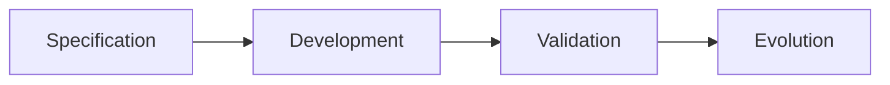
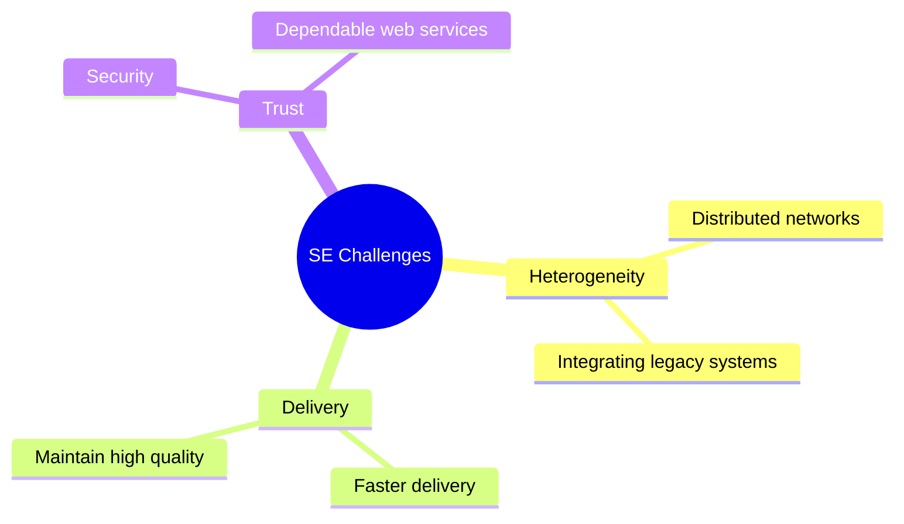
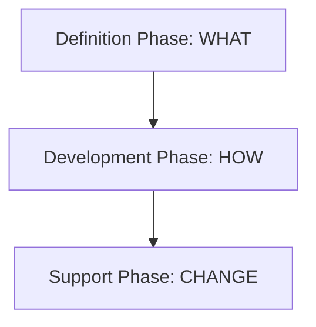
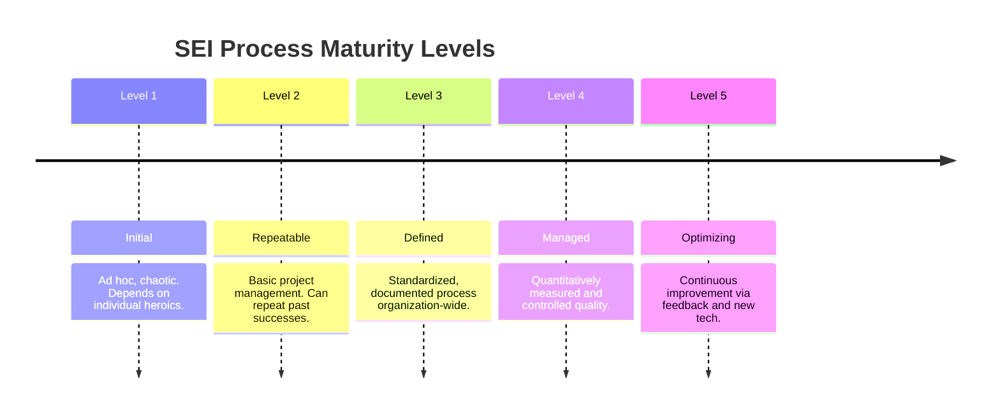

# 🚀 Software Engineering: Quick Exam Revision

### 1. Core Distinctions

- **Software:** Computer programs + associated documentation.
    
- **Software Engineering (SE):** Engineering discipline for _all_ aspects of software production (technical + management).
    
- **SE vs. CS:** CS = theories and fundamentals; SE = practical problems of producing software.
    
- **SE vs. System Engineering:** System engineering includes hardware and policy; SE is a sub-discipline of it.
    

---

### 2. The Software Process

A set of activities to develop or evolve software.

Code snippet

- **Specification:** Defining what the software must do and its constraints.
    
- **Development:** Designing and programming the system.
    
- **Validation:** Checking it meets customer requirements.
    
- **Evolution:** Modifying to adapt to changing needs.
    

**Process Models (Views):**

- **Workflow:** Sequence of _human actions_ and dependencies.
    
- **Dataflow:** How _information transforms_ (e.g., spec $\rightarrow$ design).
    
- **Role/Action:** _Who_ does what.
    

**Development Paradigms:**

- **Waterfall:** Sequential, strict phases ("sign-off" required).
    
- **Iterative:** Interleaved phases; rapid abstract build refined by customer input.
    
- **CBSE:** Assembling pre-existing components.
    

---

### 3. Costs & 21st Century Challenges

- **Costs:** ~60% development, 40% testing. Evolution often exceeds dev costs.
    

Code snippet

---

### 4. Attributes of Good Software (Non-Functional)

- **Maintainability:** Capable of evolving with changing business needs.
    
- **Dependability:** Reliable, secure, and safe (no physical/economic damage on failure).
    
- **Efficiency:** Does not waste system resources (memory, CPU).
    
- **Usability:** Appropriate UI and docs for the target user.
    

---

### 5. Methods & CASE Tools

- **Methods:** Structured approaches (like UML) containing models, rules, recommendations, and process guidance.
    
- **CASE:** _Computer-Aided Software Engineering_. Automated tools to support process activities (editors, debuggers, analysis modules).
    

---

### 6. Generic View of SE

Code snippet

- **Definition:** Identify requirements, constraints, and validation criteria.
    
- **Development:** Architecture, data structures, coding, and testing.
    
- **Support (4 Types of Change):**
    
    - _Correction:_ Fixing bugs/defects.
        
    - _Adaptation:_ Adjusting to new OS/Hardware.
        
    - _Enhancement:_ Adding new features (perfective).
        
    - _Prevention:_ Reengineering to prevent deterioration.
        
- **Umbrella Activities:** Occur throughout the entire project (e.g., Risk management, QA, configuration management).
    

---

### 7. SEI CMM (Process Maturity Levels)

Code snippet

- **Note on KPAs (Key Process Areas):** Requirements needed to hit each level (Goals, Commitments, Abilities, Activities, Verification).