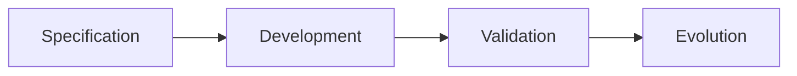
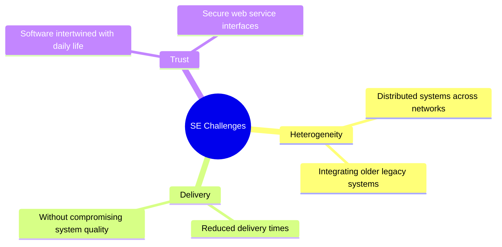
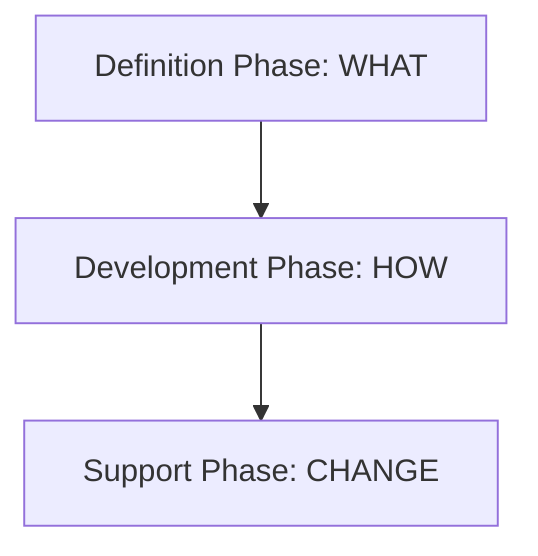
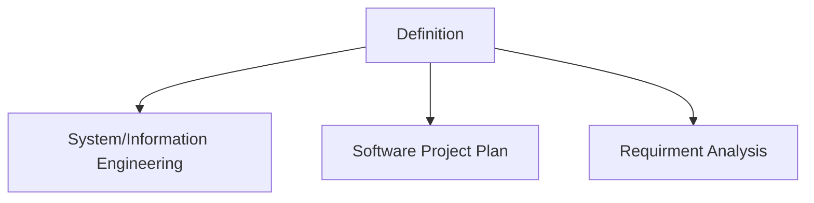
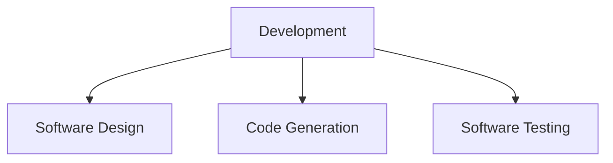
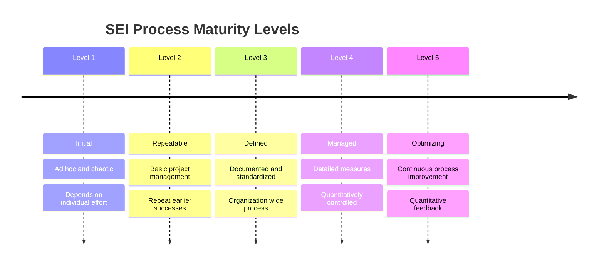

---
tags:
  - software-engineering
date: 05/09/2026
instructor: Zerina Begum
---

# Comprehensive Software Engineering Fundamentals

## 1. Core Concepts & Definitions

**Software:**

- Consists of `computer programs` and their associated `documentation`.

- Products can be built for a `particular customer` or a `general market`.

**Software Engineering (SE):**

- An `engineering discipline` focused on `all aspects of software production`.

- Spans from early `system specification` to post-deployment `maintenance`.

- **Engineering Discipline:** Engineers apply `theories, methods, and tools` selectively to solve problems and make things work. They must operate within `organisational and financial constraints`.

- **All Aspects:** SE goes beyond technical programming to include `software project management` and the development of `tools, methods, and theories` to support production.

**Discipline Comparisons:**

- **SE vs. Computer Science:**

- Computer science deals with `theories and methods` that underlie systems.

- Software engineering deals with the `practical problems of producing software`.

- **SE vs. System Engineering:**

- System engineering encompasses the development of complex systems where software plays a role, including `hardware development, policy and process design, and system deployment`.

- System engineers focus on defining `overall architecture` and integrating parts, making SE a sub-component of this broader discipline.

---

## 2. The Software Process & Models

**Software Process:**

- A set of `activities and associated results` aimed at producing a `software product`.

- **Software Specification:** Defining `what the software will do` (to be produced) and operational `constraints`.

- **Software Development:** `Designing and programming` the software.

- **Software Validation:** Checking that the software is what the `customer requires`.

- **Software Evolution:** Modifying the software to adapt to `changing customer and market requirements`.

**Software Process Models:**

- A `simplified description` of a software process presented from one specific view.

- **Workflow Model:** Shows the `sequence of activities`, highlighting inputs, outputs, and dependencies representing `human actions`.

- **Dataflow / Activity Model:** Shows data transformation activities, mapping how an `input transforms to an output` (e.g., specification to design) via people or computers.

- **Role/Action Model:** Shows the `roles of people` involved and the specific activities for which they are `responsible`.

**Paradigms of Software Development:**

- **Waterfall Approach:** Represents activities as `separate process phases` (requirements, design, implementation, testing) that must be `signed-off` sequentially.

- **Iterative Development:** `Interleaves the activities` of specification, development, and validation. Rapidly builds an initial system from `abstract specifications` to refine with customer input.

- **Component-Based (CBSE):** Assumes `parts of the system already exist` to be integrated.

---

## 3. Costs and Challenges

**Costs:**

- Typically split: `60% development costs` and `40% testing costs`.

- For custom software, `evolution costs often exceed development costs`.

**Key Challenges in the 21st Century:**

- **Heterogeneity:** Building dependable software for `distributed systems` and integrating new software with `older legacy systems` across different platforms.

- **Delivery:** Shortening `delivery times` for complex systems to match rapid business changes without compromising `system quality`.

- **Trust:** Developing techniques to demonstrate software is `trustworthy`, especially for remote web services.

---

## 4. Attributes of Good Software

Attributes reflect the software's execution behavior, code structure, and associated documentation rather than just its services.

- **Maintainability:** Must be written to `evolve to meet changing needs`, critical due to a changing business environment.

- **Dependability:** Encompasses `reliability, security, and safety`; it should not cause physical or economic damage during failure.

- **Efficiency:** Must not make `wasteful use of system resources` (e.g., memory, processor cycles), prioritizing responsiveness and processing time.

- **Usability:** Must be usable without `undue effort` by its target audience, requiring an `appropriate user interface` and `adequate documentation`.

---

## 5. Software Engineering Methods & CASE

**Methods:**

- `Structured approaches` aimed at facilitating the production of high-quality software cost-effectively.

- Different methods have been integrated into the `Unified Modeling Language (UML)`.

- _Components of a Method:_

- `System model descriptions:` Descriptions of models to be developed and their notation.

- `Rules:` Constraints that always apply to system models.

- `Recommendations:` Heuristics characterizing good design practice.

- `Process guidance:` Descriptions of activities to follow to develop the models.

**CASE (Computer-Aided Software Engineering):**

- Software systems intended to provide `automated support for software process activities`.

- Often used for `method support` (e.g., notation editors, analysis modules, report generators).

---

## 6. A Generic View of Software Engineering

- **The Definition Phase (What):** Identifies `what information is to be processed`, desired function, performance, interfaces, design constraints, and validation criteria.

    
- **The Development Phase (How):** Defines `how data are to be structured`, software architecture implemented, procedural details characterized, and testing performed.

    
- **The Support Phase (Change):** Focuses on change over time, reapplying definition and development steps to existing software. Four types of change include:

- **Correction:** `Corrective maintenance` to fix defects uncovered by the customer.

- **Adaptation:** `Adaptive maintenance` to modify the software to accommodate changes to its external environment (e.g., OS, CPU).

- **Enhancement:** `Perfective maintenance` extending software beyond its original functional requirements for user benefit.

- **Prevention:** `Preventive maintenance` (software reengineering) to make future corrections and adaptations easier.

**Umbrella Activities:** Activities that overlay the entire process, regardless of project size.

- Software project `tracking and control`.

- Formal `technical reviews`.

- Software `quality assurance`.

- Software `configuration management`.

- `Document preparation` and production.

- `Reusability management`.

- `Measurement`.

- `Risk management`.

---

## 7. SEI Process Maturity Levels (CMM)

- **Level 1 (Initial):** Process is `ad hoc and occasionally chaotic`; success depends heavily on `individual effort`.

- **Level 2 (Repeatable):** `Basic project management` tracks cost, schedule, and functionality to `repeat earlier successes` on similar projects.

- **Level 3 (Defined):** Processes for management and engineering are `documented, standardized, and integrated` organization-wide.

- **Level 4 (Managed):** Process and product quality are `quantitatively understood and controlled` using detailed measures.

- **Level 5 (Optimizing):** Focuses on `continuous process improvement` via quantitative feedback and testing innovative technologies.

**Key Process Areas (KPAs):** Functions that must be present to satisfy good practice at each maturity level. Each KPA is described by:

- `Goals:` Overall objectives the KPA must achieve.

- `Commitments:` Requirements imposed on the organization to achieve goals.

- `Abilities:` Technical/organizational structures needed to meet commitments.

- `Activities:` Specific tasks required to achieve the function.

- `Monitoring methods:` The manner in which activities are monitored.

- `Verifying methods:` The manner in which proper practice is verified.