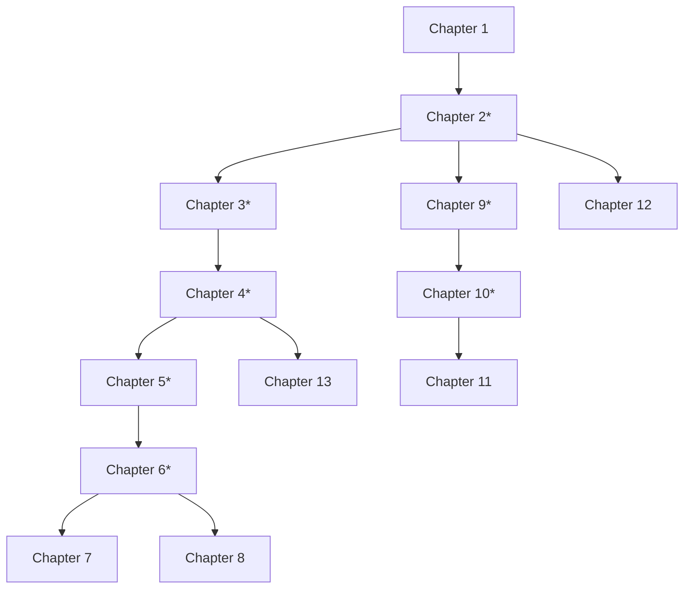

# Discrete Mathematics and Its Applications
**Eighth Edition**

**Kenneth H. Rosen**  
*formerly AT&T Laboratories*

McGraw-Hill Education

---

## Copyright & Publication Details

**DISCRETE MATHEMATICS AND ITS APPLICATIONS, EIGHTH EDITION**

Published by McGraw-Hill Education, 2 Penn Plaza, New York, NY 10121. Copyright © 2019 by McGraw-Hill Education. All rights reserved. Printed in the United States of America. Previous editions © 2012, 2007, and 2003. No part of this publication may be reproduced or distributed in any form or by any means, or stored in a database or retrieval system, without the prior written consent of McGraw-Hill Education, including, but not limited to, in any network or other electronic storage or transmission, or broadcast for distance learning.

Some ancillaries, including electronic and print components, may not be available to customers outside the United States.

This book is printed on acid-free paper.

1 2 3 4 5 6 7 8 9 LWI 21 20 19 18

**ISBN:** 978-1-259-67651-2  
**MHID:** 1-259-67651-X

- **Product Developer:** Nora Devlin
- **Marketing Manager:** Alison Frederick
- **Content Project Manager:** Peggy Selle
- **Buyer:** Sandy Ludovissy
- **Design:** Egzon Shaqiri
- **Content Licensing Specialist:** Lorraine Buczek
- **Cover Image:** © Karl Dehnam/Alamy Stock Photo
- **Compositor:** Aptara, Inc.

All credits appearing on page or at the end of the book are considered to be an extension of the copyright page.

### Library of Congress Cataloging-in-Publication Data

- **Names:** Rosen, Kenneth H., author.
- **Title:** Discrete mathematics and its applications / Kenneth H. Rosen, Monmouth University (and formerly AT&T Laboratories).
- **Description:** Eighth edition. | New York, NY : McGraw-Hill, [2019] | Includes bibliographical references and index.
- **Identifiers:** LCCN 2018008740 | ISBN 9781259676512 (alk. paper) | ISBN 125967651X (alk. paper)
- **Subjects:** LCSH: Mathematics. | Computer science—Mathematics.
- **Classification:** LCC QA39.3 .R67 2019 | DDC 511–dc23 LC record available at [https://lccn.loc.gov/2018008740](https://lccn.loc.gov/2018008740)

The Internet addresses listed in the text were accurate at the time of publication. The inclusion of a website does not indicate an endorsement by the authors or McGraw-Hill Education, and McGraw-Hill Education does not guarantee the accuracy of the information presented at these sites.

[mheducation.com/highered](https://mheducation.com/highered)

---

# Contents

- **About the Author** vi
- **Preface** vii
- **Online Resources** xvi
- **To the Student** xix

---

### 1 The Foundations: Logic and Proofs — 1
- **1.1** Propositional Logic ................................................................ 1
- **1.2** Applications of Propositional Logic ............................................. 17
- **1.3** Propositional Equivalences ........................................................ 26
- **1.4** Predicates and Quantifiers ........................................................ 40
- **1.5** Nested Quantifiers ................................................................ 60
- **1.6** Rules of Inference ................................................................ 73
- **1.7** Introduction to Proofs ............................................................ 84
- **1.8** Proof Methods and Strategy ........................................................ 96
- **End-of-Chapter Material** ............................................................ 115

---

### 2 Basic Structures: Sets, Functions, Sequences, Sums, and Matrices — 121
- **2.1** Sets ............................................................................ 121
- **2.2** Set Operations ................................................................... 133
- **2.3** Functions ........................................................................ 147
- **2.4** Sequences and Summations ......................................................... 165
- **2.5** Cardinality of Sets .............................................................. 179
- **2.6** Matrices ......................................................................... 188
- **End-of-Chapter Material** ............................................................ 195

---

### 3 Algorithms — 201
- **3.1** Algorithms ....................................................................... 201
- **3.2** The Growth of Functions .......................................................... 216
- **3.3** Complexity of Algorithms ......................................................... 231
- **End-of-Chapter Material** ............................................................ 244

---

### 4 Number Theory and Cryptography — 251
- **4.1** Divisibility and Modular Arithmetic ............................................. 251
- **4.2** Integer Representations and Algorithms ........................................... 260
- **4.3** Primes and Greatest Common Divisors .............................................. 271
- **4.4** Solving Congruences .............................................................. 290
- **4.5** Applications of Congruences ...................................................... 303
- **4.6** Cryptography .................................................................... 310
- **End-of-Chapter Material** ............................................................ 324

---

### 5 Induction and Recursion — 331
- **5.1** Mathematical Induction ........................................................... 331
- **5.2** Strong Induction and Well-Ordering ............................................... 354
- **5.3** Recursive Definitions and Structural Induction ................................... 365
- **5.4** Recursive Algorithms ............................................................. 381
- **5.5** Program Correctness .............................................................. 393
- **End-of-Chapter Material** ............................................................ 398

---

### 6 Counting — 405
- **6.1** The Basics of Counting ........................................................... 405
- **6.2** The Pigeonhole Principle ......................................................... 420
- **6.3** Permutations and Combinations .................................................... 428
- **6.4** Binomial Coefficients and Identities ............................................. 437
- **6.5** Generalized Permutations and Combinations ........................................ 445
- **6.6** Generating Permutations and Combinations ......................................... 457
- **End-of-Chapter Material** ............................................................ 461

---

### 7 Discrete Probability — 469
- **7.1** An Introduction to Discrete Probability .......................................... 469
- **7.2** Probability Theory ............................................................... 477
- **7.3** Bayes’ Theorem ................................................................... 494
- **7.4** Expected Value and Variance ...................................................... 503
- **End-of-Chapter Material** ............................................................ 520

---

### 8 Advanced Counting Techniques — 527
- **8.1** Applications of Recurrence Relations ............................................ 527
- **8.2** Solving Linear Recurrence Relations .............................................. 540
- **8.3** Divide-and-Conquer Algorithms and Recurrence Relations ........................... 553
- **8.4** Generating Functions ............................................................. 563
- **8.5** Inclusion–Exclusion .............................................................. 579
- **8.6** Applications of Inclusion–Exclusion .............................................. 585
- **End-of-Chapter Material** ............................................................ 592

---

### 9 Relations — 599
- **9.1** Relations and Their Properties ................................................... 599
- **9.2** $n$-ary Relations and Their Applications .......................................... 611
- **9.3** Representing Relations ........................................................... 621
- **9.4** Closures of Relations ............................................................ 628
- **9.5** Equivalence Relations ............................................................ 638
- **9.6** Partial Orderings ................................................................ 650
- **End-of-Chapter Material** ............................................................ 665

---

### 10 Graphs — 673
- **10.1** Graphs and Graph Models ........................................................ 673
- **10.2** Graph Terminology and Special Types of Graphs ................................... 685
- **10.3** Representing Graphs and Graph Isomorphism ....................................... 703
- **10.4** Connectivity ................................................................... 714
- **10.5** Euler and Hamilton Paths ........................................................ 728
- **10.6** Shortest-Path Problems .......................................................... 743
- **10.7** Planar Graphs ................................................................... 753
- **10.8** Graph Coloring ................................................................. 762
- **End-of-Chapter Material** ............................................................ 771

---

### 11 Trees — 781
- **11.1** Introduction to Trees ........................................................... 781
- **11.2** Applications of Trees ........................................................... 793
- **11.3** Tree Traversal .................................................................. 808
- **11.4** Spanning Trees .................................................................. 821
- **11.5** Minimum Spanning Trees .......................................................... 835
- **End-of-Chapter Material** ............................................................ 841

---

### 12 Boolean Algebra — 847
- **12.1** Boolean Functions ............................................................... 847
- **12.2** Representing Boolean Functions ................................................... 855
- **12.3** Logic Gates ..................................................................... 858
- **12.4** Minimization of Circuits ........................................................ 864
- **End-of-Chapter Material** ............................................................ 879

---

### 13 Modeling Computation — 885
- **13.1** Languages and Grammars ......................................................... 885
- **13.2** Finite-State Machines with Output ............................................... 897
- **13.3** Finite-State Machines with No Output ........................................... 904
- **13.4** Language Recognition ............................................................ 917
- **13.5** Turing Machines ................................................................. 927
- **End-of-Chapter Material** ............................................................ 938

---

### Appendices — A-1
- **1** Axioms for the Real Numbers and the Positive Integers .............................. A-1
- **2** Exponential and Logarithmic Functions .............................................. A-7
- **3** Pseudocode ......................................................................... A-11

- **Suggested Readings** ................................................................... B-1
- **Answers to Odd-Numbered Exercises** .................................................... S-1
- **Index of Biographies** ................................................................. I-1
- **Index** ................................................................................. I-2

---

# About the Author

**Kenneth H. Rosen** received his B.S. in Mathematics from the University of Michigan, Ann Arbor (1972), and his Ph.D. in Mathematics from M.I.T. (1976), where he wrote his thesis in number theory under the direction of Harold Stark. Before joining Bell Laboratories in 1982, he held positions at the University of Colorado, Boulder; The Ohio State University, Columbus; and the University of Maine, Orono, where he was an associate professor of mathematics. He enjoyed a long career as a Distinguished Member of the Technical Staff at AT&T Bell Laboratories (and AT&T Laboratories) in Monmouth County, New Jersey. While working at Bell Labs, he taught at Monmouth University, teaching courses in discrete mathematics, coding theory, and data security. After leaving AT&T Labs, he became a visiting research professor of computer science at Monmouth University, where he has taught courses in algorithm design, computer security and cryptography, and discrete mathematics.

Dr. Rosen has published numerous articles in professional journals on number theory and on mathematical modeling. He is the author of the widely used *Elementary Number Theory and Its Applications*, published by Pearson, currently in its sixth edition, which has been translated into Chinese. He is also the author of *Discrete Mathematics and Its Applications*, published by McGraw-Hill, currently in its eighth edition. *Discrete Mathematics and Its Applications* has sold more than 450,000 copies in North America during its lifetime, and hundreds of thousands of copies throughout the rest of the world. This book has also been translated into many languages, including Spanish, French, Portuguese, Greek, Chinese, Vietnamese, and Korean. He is also co-author of *UNIX: The Complete Reference*; *UNIX System V Release 4: An Introduction*; and *Best UNIX Tips Ever*, all published by Osborne McGraw-Hill. These books have sold more than 150,000 copies, with translations into Chinese, German, Spanish, and Italian. Dr. Rosen is also the editor of both the first and second editions (published in 1999 and 2018, respectively) of the *Handbook of Discrete and Combinatorial Mathematics*, published by CRC Press. He has served as the advisory editor of the CRC series of books in discrete mathematics, sponsoring more than 70 volumes on diverse aspects of discrete mathematics, many of which are introduced in this book. He is an advisory editor for the CRC series of mathematics textbooks, where he has helped more than 30 authors write better texts. Dr. Rosen serves as an Associate Editor for the journal *Discrete Mathematics*, where he handles papers in many areas, including graph theory, enumeration, number theory, and cryptography.

Dr. Rosen has had a longstanding interest in integrating mathematical software into the educational and professional environments. He has worked on several projects with Waterloo Maple Inc.’s Maple™ software in both these areas. Dr. Rosen has devoted a great deal of energy to ensuring that the online homework for *Discrete Mathematics and its Applications* is a superior teaching tool. Dr. Rosen has also worked with several publishing companies on their homework delivery platforms.

At Bell Laboratories and AT&T Laboratories, Dr. Rosen worked on a wide range of projects, including operations research studies, product line planning for computers and data communications equipment, technology assessment and innovation, and many other efforts. He helped plan AT&T’s products and services in the area of multimedia, including video communications, speech recognition, speech synthesis, and image networking. He evaluated new technology for use by AT&T and did standards work in the area of image networking. He also invented many new services, and holds more than 70 patents. One of his more interesting projects involved helping evaluate technology for the AT&T attraction that was part of EPCOT Center. After leaving AT&T, Dr. Rosen has worked as a technology consultant for Google and for AT&T.

---

# Preface

In writing this book, I was guided by my long-standing experience and interest in teaching discrete mathematics. For the student, my purpose was to present material in a precise, readable manner, with the concepts and techniques of discrete mathematics clearly presented and demonstrated. My goal was to show the relevance and practicality of discrete mathematics to students, who are often skeptical. I wanted to give students studying computer science all of the mathematical foundations they need for their future studies. I wanted to give mathematics students an understanding of important mathematical concepts together with a sense of why these concepts are important for applications. And most importantly, I wanted to accomplish these goals without watering down the material.

For the instructor, my purpose was to design a flexible, comprehensive teaching tool using proven pedagogical techniques in mathematics. I wanted to provide instructors with a package of materials that they could use to teach discrete mathematics effectively and efficiently in the most appropriate manner for their particular set of students. I hope that I have achieved these goals.

I have been extremely gratified by the tremendous success of this text, including its use by more than one million students around the world over the last 30 years and its translation into many different languages. The many improvements in the eighth edition have been made possible by the feedback and suggestions of a large number of instructors and students at many of the more than 600 North American schools, and at many universities in different parts of the world, where this book has been successfully used. I have been able to significantly improve the appeal and effectiveness of this book edition to edition because of the feedback I have received and the significant investments that have been made in the evolution of the book.

This text is designed for a one- or two-term introductory discrete mathematics course taken by students in a wide variety of majors, including mathematics, computer science, and engineering. College algebra is the only explicit prerequisite, although a certain degree of mathematical maturity is needed to study discrete mathematics in a meaningful way. This book has been designed to meet the needs of almost all types of introductory discrete mathematics courses. It is highly flexible and extremely comprehensive. The book is designed not only to be a successful textbook, but also to serve as a valuable resource students can consult throughout their studies and professional life.

## Goals of a Discrete Mathematics Course

A discrete mathematics course has more than one purpose. Students should learn a particular set of mathematical facts and how to apply them; more importantly, such a course should teach students how to think logically and mathematically. To achieve these goals, this text stresses mathematical reasoning and the different ways problems are solved. Five important themes are interwoven in this text: mathematical reasoning, combinatorial analysis, discrete structures, algorithmic thinking, and applications and modeling. A successful discrete mathematics course should carefully blend and balance all five themes.

1. **Mathematical Reasoning:** Students must understand mathematical reasoning in order to read, comprehend, and construct mathematical arguments. This text starts with a discussion of mathematical logic, which serves as the foundation for the subsequent discussions of methods of proof. Both the science and the art of constructing proofs are addressed. The technique of mathematical induction is stressed through many different types of examples of such proofs and a careful explanation of why mathematical induction is a valid proof technique.
2. **Combinatorial Analysis:** An important problem-solving skill is the ability to count or enumerate objects. The discussion of enumeration in this book begins with the basic techniques of counting. The stress is on performing combinatorial analysis to solve counting problems and analyze algorithms, not on applying formulae.
3. **Discrete Structures:** A course in discrete mathematics should teach students how to work with discrete structures, which are the abstract mathematical structures used to represent discrete objects and relationships between these objects. These discrete structures include sets, permutations, relations, graphs, trees, and finite-state machines.
4. **Algorithmic Thinking:** Certain classes of problems are solved by the specification of an algorithm. After an algorithm has been described, a computer program can be constructed implementing it. The mathematical portions of this activity, which include the specification of the algorithm, the verification that it works properly, and the analysis of the computer memory and time required to perform it, are all covered in this text. Algorithms are described using both English and an easily understood form of pseudocode.
5. **Applications and Modeling:** Discrete mathematics has applications to almost every conceivable area of study. There are many applications to computer science and data networking in this text, as well as applications to such diverse areas as chemistry, biology, linguistics, geography, business, and the Internet. These applications are natural and important uses of discrete mathematics and are not contrived. Modeling with discrete mathematics is an extremely important problem-solving skill, which students have the opportunity to develop by constructing their own models in some of the exercises.

## Changes in the Eighth Edition

Although the seventh edition has been an extremely effective text, many instructors have requested changes to make the book more useful to them. I have devoted a significant amount of time and energy to satisfy their requests and I have worked hard to find my own ways to improve the book and to keep it up-to-date.

The eighth edition includes changes based on input from more than 20 formal reviewers, feedback from students and instructors, and my insights. The result is a new edition that I expect will be a more effective teaching tool. Numerous changes in the eighth edition have been designed to help students learn the material. Additional explanations and examples have been added to clarify material where students have had difficulty. New exercises, both routine and challenging, have been added. Highly relevant applications, including many related to the Internet, to computer science, and to mathematical biology, have been added. The companion website has benefited from extensive development; it now provides extensive tools students can use to master key concepts and to explore the world of discrete mathematics. Furthermore, additional effective and comprehensive learning and assessment tools are available, complementing the textbook.

I hope that instructors will closely examine this new edition to discover how it might meet their needs. Although it is impractical to list all the changes in this edition, a brief list that highlights some key changes, listed by the benefits they provide, may be useful.

### Overall Changes

- **Exposition** has been improved throughout the book with a focus on providing more clarity to help students read and comprehend concepts.
- **Proofs:** Many proofs have been enhanced by adding more details and explanations, and by reminding the reader of the proof methods used.
- **Examples:** New examples have been added, often to meet needs identified by reviewers or to illustrate new material. Many of these examples are found in the text, but others are available only on the companion website.
- **Exercises:** Many new exercises, both routine and challenging, address needs identified by instructors or cover new material, while others strengthen and broaden existing exercise sets.
- **Headings & Numbering:** More second and third level heads have been used to break sections into smaller coherent parts, and a new numbering scheme has been used to identify subsections of the book.
- **Online Resources:** The online resources for this book have been greatly expanded, providing extensive support for both instructors and students. These resources are described later in the front matter.

### Topic Coverage

- **Logic:** Several logical puzzles have been introduced. A new example explains how to model the $n$-queens problem as a satisfiability problem that is both concise and accessible to students.
- **Set theory:** Multisets are now covered in the text. (Previously they were introduced in the exercises.)
- **Algorithms:** The string matching problem, an important algorithm for many applications, including spell checking, key-word searching, string-matching, and computational biology, is now discussed. The brute-force algorithm for solving string-matching exercises is presented.
- **Number theory:** The new edition includes the latest numerical and theoretic discoveries relating to primes and open conjectures about them. The extended Euclidean algorithm, a one-pass algorithm, is now discussed in the text. (Previously it was covered in the exercises.)
- **Cryptography:** The concept of homomorphic encryption, and its importance to cloud computing, is now covered.
- **Mathematical induction:** The template for proofs by mathematical induction has been expanded. It is now placed in the text before examples of proof by mathematical induction.
- **Counting methods:** The coverage of the division rule for counting has been expanded.
- **Data mining:** Association rules—key concepts in data mining—are now discussed in the section on $n$-ary relations. Also, the Jaccard metric, which is used to find the distance between two sets and which is used in data mining, is introduced in the exercises.
- **Graph theory applications:** A new example illustrates how semantic networks, an important structure in artificial intelligence, can be modeled using graphs.
- **Biographies:** New biographies of Wiles, Bhaskaracharya, de la Vallée-Poussin, Hadamard, Zhang, and Gentry have been added. Existing biographies have been expanded and updated. This adds diversity by including more historically important Eastern mathematicians, major nineteenth and twentieth century researchers, and currently active twenty-first century mathematicians and computer scientists.

## Features of the Book

- **ACCESSIBILITY:** This text has proven to be easily read and understood by many beginning students. There are no mathematical prerequisites beyond college algebra for almost all the contents of the text. Students needing extra help will find tools on the companion website for bringing their mathematical maturity up to the level of the text. The few places in the book where calculus is referred to are explicitly noted. Most students should easily understand the pseudocode used in the text to express algorithms, regardless of whether they have formally studied programming languages. There is no formal computer science prerequisite.  
  Each chapter begins at an easily understood and accessible level. Once basic mathematical concepts have been carefully developed, more difficult material and applications to other areas of study are presented.
- **FLEXIBILITY:** This text has been carefully designed for flexible use. The dependence of chapters on previous material has been minimized. Each chapter is divided into sections of approximately the same length, and each section is divided into subsections that form natural blocks of material for teaching. Instructors can easily pace their lectures using these blocks.
- **WRITING STYLE:** The writing style in this book is direct and pragmatic. Precise mathematical language is used without excessive formalism and abstraction. Care has been taken to balance the mix of notation and words in mathematical statements.
- **MATHEMATICAL RIGOR AND PRECISION:** All definitions and theorems in this text are stated extremely carefully so that students will appreciate the precision of language and rigor needed in mathematics. Proofs are motivated and developed slowly; their steps are all carefully justified. The axioms used in proofs and the basic properties that follow from them are explicitly described in an appendix, giving students a clear idea of what they can assume in a proof. Recursive definitions are explained and used extensively.
- **WORKED EXAMPLES:** Over 800 examples are used to illustrate concepts, relate different topics, and introduce applications. In most examples, a question is first posed, then its solution is presented with the appropriate amount of detail.
- **APPLICATIONS:** The applications included in this text demonstrate the utility of discrete mathematics in the solution of real-world problems. This text includes applications to a wide variety of areas, including computer science, data networking, psychology, chemistry, engineering, linguistics, biology, business, and the Internet.
- **ALGORITHMS:** Results in discrete mathematics are often expressed in terms of algorithms; hence, key algorithms are introduced in most chapters of the book. These algorithms are expressed in words and in an easily understood form of structured pseudocode, which is described and specified in Appendix 3. The computational complexity of the algorithms in the text is also analyzed at an elementary level.
- **HISTORICAL INFORMATION:** The background of many topics is succinctly described in the text. Brief biographies of 89 mathematicians and computer scientists are included as footnotes. These biographies include information about the lives, careers, and accomplishments of these important contributors to discrete mathematics, and images, when available, are displayed.  
  In addition, numerous historical footnotes are included that supplement the historical information in the main body of the text. Efforts have been made to keep the book up-to-date by reflecting the latest discoveries.
- **KEY TERMS AND RESULTS:** A list of key terms and results follows each chapter. The key terms include only the most important that students should learn, and not every term defined in the chapter.
- **EXERCISES:** There are over 4200 exercises in the text, with many different types of questions posed. There is an ample supply of straightforward exercises that develop basic skills, a large number of intermediate exercises, and many challenging exercises. Exercises are stated clearly and unambiguously, and all are carefully graded for level of difficulty. Exercise sets contain special discussions that develop new concepts not covered in the text, enabling students to discover new ideas through their own work.  
  Exercises that are somewhat more difficult than average are marked with a single star, $*$; those that are much more challenging are marked with two stars, $**$. Exercises whose solutions require calculus are explicitly noted. Exercises that develop results used in the text are clearly identified with the right pointing hand symbol, ☞. Answers or outlined solutions to all odd-numbered exercises are provided at the back of the text. The solutions include proofs in which most of the steps are clearly spelled out.
- **REVIEW QUESTIONS:** A set of review questions is provided at the end of each chapter. These questions are designed to help students focus their study on the most important concepts and techniques of that chapter. To answer these questions students need to write long answers, rather than just perform calculations or give short replies.
- **SUPPLEMENTARY EXERCISE SETS:** Each chapter is followed by a rich and varied set of supplementary exercises. These exercises are generally more difficult than those in the exercise sets following the sections. The supplementary exercises reinforce the concepts of the chapter and integrate different topics more effectively.
- **COMPUTER PROJECTS:** Each chapter is followed by a set of computer projects. The approximately 150 computer projects tie together what students may have learned in computing and in discrete mathematics. Computer projects that are more difficult than average, from both a mathematical and a programming point of view, are marked with a star, and those that are extremely challenging are marked with two stars.
- **COMPUTATIONS AND EXPLORATIONS:** A set of computations and explorations is included at the conclusion of each chapter. These exercises (approximately 120 in total) are designed to be completed using existing software tools, such as programs that students or instructors have written or mathematical computation packages such as Maple™ or Mathematica™. Many of these exercises give students the opportunity to uncover new facts and ideas through computation. (Some of these exercises are discussed in the *Exploring Discrete Mathematics* companion workbooks available online.)
- **WRITING PROJECTS:** Each chapter is followed by a set of writing projects. To do these projects students need to consult the mathematical literature. Some of these projects are historical in nature and may involve looking up original sources. Others are designed to serve as gateways to new topics and ideas. All are designed to expose students to ideas not covered in depth in the text. These projects tie mathematical concepts together with the writing process and help expose students to possible areas for future study. (Suggested references for these projects can be found online or in the printed *Student’s Solutions Guide*.)
- **APPENDICES:** There are three appendices to the text. The first introduces axioms for real numbers and the positive integers, and illustrates how facts are proved directly from these axioms. The second covers exponential and logarithmic functions, reviewing some basic material used heavily in the course. The third specifies the pseudocode used to describe algorithms in this text.
- **SUGGESTED READINGS:** A list of suggested readings for the overall book and for each chapter is provided after the appendices. These suggested readings include books at or below the level of this text, more difficult books, expository articles, and articles in which discoveries in discrete mathematics were originally published. Some of these publications are classics, published many years ago, while others have been published in the last few years. These suggested readings are complemented by the many links to valuable resources available on the web that can be found on the website for this book.

## How to Use This Book

This text has been carefully written and constructed to support discrete mathematics courses at several levels and with differing foci. The following table identifies the core and optional sections. An introductory one-term course in discrete mathematics at the sophomore level can be based on the core sections of the text, with other sections covered at the discretion of the instructor. A two-term introductory course can include all the optional mathematics sections in addition to the core sections. A course with a strong computer science emphasis can be taught by covering some or all of the optional computer science sections. Instructors can find sample syllabi for a wide range of discrete mathematics courses and teaching suggestions for using each section of the text can be found in the *Instructor’s Resource Guide* available on the website for this book.

| Chapter | Core | Optional CS | Optional Math |
| :--- | :--- | :--- | :--- |
| **1** | 1.1–1.8 (as needed) | | |
| **2** | 2.1–2.4, 2.6 (as needed) | | 2.5 |
| **3** | | 3.1–3.3 (as needed) | |
| **4** | 4.1–4.4 (as needed) | 4.5, 4.6 | |
| **5** | 5.1–5.3 | 5.4, 5.5 | |
| **6** | 6.1–6.3 | 6.6 | 6.4, 6.5 |
| **7** | 7.1 | 7.4 | 7.2, 7.3 |
| **8** | 8.1, 8.5 | 8.3 | 8.2, 8.4, 8.6 |
| **9** | 9.1, 9.3, 9.5 | 9.2 | 9.4, 9.6 |
| **10** | 10.1–10.5 | | 10.6–10.8 |
| **11** | 11.1 | 11.2, 11.3 | 11.4, 11.5 |
| **12** | | 12.1–12.4 | |
| **13** | | 13.1–13.5 | |

Instructors using this book can adjust the level of difficulty of their course by choosing either to cover or to omit the more challenging examples at the end of sections, as well as the more challenging exercises. The chapter dependency chart shown below displays the strong dependencies. A star indicates that only relevant sections of the chapter are needed for study of a later chapter. Weak dependencies have been ignored. More details can be found in the *Instructor’s Resource Guide*.

## Ancillaries

- **STUDENT’S SOLUTIONS GUIDE:** This student manual, available separately, contains full solutions to all odd-numbered exercises in the exercise sets. These solutions explain why a particular method is used and why it works. For some exercises, one or two other possible approaches are described to show that a problem can be solved in several different ways. Suggested references for the writing projects found at the end of each chapter are also included in this volume. Also included are a guide to writing proofs and an extensive description of common mistakes students make in discrete mathematics, plus sample tests and a sample crib sheet for each chapter designed to help students prepare for exams.
- **INSTRUCTOR’S RESOURCE GUIDE:** This manual, available on the website and in printed form by request for instructors, contains full solutions to even-numbered exercises in the text. Suggestions on how to teach the material in each chapter of the book are provided, including the points to stress in each section and how to put the material into perspective. It also offers sample tests for each chapter and a test bank containing over 1500 exam questions to choose from. Answers to all sample tests and test bank questions are included. Finally, sample syllabi are presented for courses with differing emphases and student ability levels.

## Acknowledgments

I would like to thank the many instructors and students at a variety of schools who have used this book and provided me with their valuable feedback and helpful suggestions. Their input has made this a much better book than it would have been otherwise. I especially want to thank Jerrold Grossman and Dan Jordan for their technical reviews of the eighth edition and their “eagle eyes,” which have helped ensure the accuracy and quality of this book. Both have proofread every part of the book many times as it has gone through the different steps of production and have helped eliminate old errata and prevented the insertion of new errata.

Thanks go to Dan Jordan for his work on the student solutions manual and instructor’s resource guide. He has done an admirable job updating these ancillaries. Jerrold Grossman, the author of these ancillaries for the first seven editions of the book, has provided valuable assistance to Dan. I would also like to express my gratitude to the many people who have helped create and maintain the online resources for this book. In particular, special thanks go to Dan Jordan and Rochus Boerner for their extensive work improving online questions for the Connect Site, described later in this preface.

I thank the reviewers of this eighth and all previous editions. These reviewers have provided much helpful criticism and encouragement to me. I hope this edition lives up to their high expectations. There have been well in excess of 200 reviewers of this book since its first edition, with many from countries other than the United States. The most recent reviewers are listed here.

### Recent Reviewers

- **Barbara Anthony**, *Southwestern University*
- **Philip Barry**, *University of Minnesota, Minneapolis*
- **Benkam Bobga**, *University of North Georgia*
- **Miklos Bona**, *University of Florida*
- **Steve Brick**, *University of South Alabama*
- **Kirby Brown**, *Queens College*
- **John Carter**, *University of Toronto*
- **Narendra Chaudhari**, *Nanyang Technological University*
- **Tim Chappell**, *Penn Valley Community College*
- **Allan Cochran**, *University of Arkansas*
- **Daniel Cunningham**, *Buffalo State College*
- **H.K. Dai**, *Oklahoma State University*
- **George Davis**, *Georgia State University*
- **Andrzej Derdzinski**, *The Ohio State University*
- **Ronald Dotzel**, *University of Missouri-St. Louis*
- **T.J. Duda**, *Columbus State Community College*
- **Bruce Elenbogen**, *University of Michigan, Dearborn*
- **Norma Elias**, *Purdue University, Calumet-Hammond*
- **Herbert Enderton**, *University of California, Los Angeles*
- **Anthony Evans**, *Wright State University*
- **Kim Factor**, *Marquette University*
- **Margaret Fleck**, *University of Illinois, Champaign*
- **Melissa Gaddini**, *Robert Morris University*
- **Peter Gillespie**, *Fayetteville State University*
- **Johannes Hattingh**, *Georgia State University*
- **James Helmreich**, *Marist College*
- **Ken Holladay**, *University of New Orleans*
- **Jerry Ianni**, *LaGuardia Community College*
- **Milagros Izquierdo**, *Linköping University*
- **Ravi Janardan**, *University of Minnesota, Minneapolis*
- **Norliza Katuk**, *University of Utara Malaysia*
- **Monika Kiss**, *Saint Leo University*
- **William Klostermeyer**, *University of North Florida*
- **Przemo Kranz**, *University of Mississippi*
- **Jaromy Kuhl**, *University of West Florida*
- **Loredana Lanzani**, *University of Arkansas, Fayetteville*
- **Frederic Latour**, *Central Connecticut State University*
- **Steven Leonhardi**, *Winona State University*
- **Chunlei Liu**, *Valdosta State University*
- **Xu Liutong**, *Beijing University of Posts and Telecommunications*
- **Vladimir Logvinenko**, *De Anza Community College*
- **Tamsen McGinley**, *Santa Clara University*
- **Ramon A. Mata-Toledo**, *James Madison University*
- **Tamara Melnik**, *Computer Systems Institute*
- **Osvaldo Mendez**, *University of Texas at El Paso*
- **Darrell Minor**, *Columbus State Community College*
- **Kathleen O’Connor**, *Quinsigamond Community College*
- **Keith Olson**, *Utah Valley University*
- **Dimitris Papamichail**, *The College of New Jersey*
- **Yongyuth Permpoontanalarp**, *King Mongkut’s University of Technology, Thonburi*
- **Galin Piatniskaia**, *University of Missouri, St. Louis*
- **Shawon Rahman**, *University of Hawaii at Hilo*
- **Eric Rawdon**, *University of St. Thomas*
- **Stefan Robila**, *Montclair State University*
- **Chris Rodger**, *Auburn University*
- **Sukhit Singh**, *Texas State University, San Marcos*
- **David Snyder**, *Texas State University, San Marcos*
- **Wasin So**, *San Jose State University*
- **Bogdan Suceava**, *California State University, Fullerton*
- **Christopher Swanson**, *Ashland University*
- **Bon Sy**, *Queens College*
- **Fereja Tahir**, *Illinois Central College*
- **K.A. Venkatesh**, *Presidency University*
- **Matthew Walsh**, *Indiana-Purdue University, Fort Wayne*
- **Sheri Wang**, *University of Phoenix*
- **Gideon Weinstein**, *Western Governors University*
- **David Wilczynski**, *University of Southern California*
- **James Wooland**, *Florida State University*

I also want to thank the many students who have provided suggestions and reported errata. The students in the discrete mathematics courses I have taught at Monmouth University, both undergraduate and graduate computer science students, have helped me improve the book in many ways.

There are many people to thank at McGraw-Hill Higher Education, the publisher of this book, as well as people who did the production work at Aptara. I would also like to thank the original editor at Random House, Wayne Yuhasz, whose insights and skills helped ensure the book’s success, as well as all the many other previous editors of this book.

I want to express my deep appreciation to Nora Devlin, the Product Developer who has gone far beyond her assigned duties to support the author. She has displayed many skills and virtues working to solve a wide variety of problems that have arisen in the development of this new edition.

I am also grateful to Peggy Selle, the Content Product Manager, who managed the production process. She has kept the production on track and has helped resolve many issues that have arise during this process. Thanks go to Sarita Yadav, Senior Product Manager of Aptara, and her colleagues at Aptara, who worked diligently to ensure the production quality of this edition.

I also want to express my appreciation to the many others in the Science, Engineering, and Mathematics (SEM) Division of McGraw-Hill Higher Education for their valuable support for this new edition and the associated media content, including:

- **Mike Ryan**, *VP, Portfolio & Learning Content, Higher Education*
- **Kathleen McMahon**, *Managing Director, Mathematics & Physical Sciences*
- **Caroline Celano**, *Director, Mathematics*
- **Alison Frederick**, *Marketing Manager*
- **Robin Reed**, *Lead Product Developer*
- **Sandy Ludovissey**, *Buyer*
- **Egzon Shaqiri**, *Designer*
- **Tammy Juran**, *Assessment Content Project Manager*
- **Cynthia Northrup**, *Director of Digital Content*
- **Ruth Czarnecki-Lichstein**, *Business Product Manager*
- **Megan Platt**, *Editorial Coordinator*
- **Lora Neyens** and **Jolynn Kilburg**, *Program Managers*
- **Lorraine Buczek**, *Content Licensing Specialist*

*Kenneth H. Rosen*

---

# Online Resources

Extensive effort has been devoted to producing valuable web resources for this book. Instructors should make a special effort to explore these resources to identify those they feel will help their students learn and explore discrete mathematics. These resources are available in the Online Learning Center, which is available to all students and instructors, and the Connect Site, designed for interactive instruction, which instructors can choose to use. To use Connect, students purchase online access for a specific time period.

## 0.1 The Online Learning Center

The Online Learning Center (OLC), accessible at `www.mhhe.com/rosen`, includes an *Information Center*, a *Student Site*, and an *Instructor Site*. Key features of each area are described here.

### 0.1.1 The Information Center

The Information Center contains basic information about the book including the expanded table of contents (including subsection heads), the preface, descriptions of the ancillaries, and a sample chapter. It also provides a link that can be used to submit errata reports and other feedback about the book.

### 0.1.2 Student Site

The Student Site contains a wealth of resources available for student use, including the following, tied into the text wherever the special icons displayed below are found in the text:

- **Extra Examples:** You can find a large number of additional examples on the site, covering all chapters of the book. These examples are concentrated in areas where students often ask for additional material. Although most of these examples amplify the basic concepts, more-challenging examples can also be found here. Many new extra examples have been recently added for the eighth edition. Each icon in the book corresponds to one or more extra examples on the website.
- **Interactive Demonstration Applets:** These applets enable you to interactively explore how important algorithms work, and are tied directly to material in the text with linkages to exercises and examples. Additional resources are provided on how to use and apply these applets.
- **Self Assessments:** These interactive guides help you assess your understanding of 14 key concepts, providing a question bank where each question includes a brief tutorial followed by a multiple-choice question. If you select an incorrect answer, advice is provided to help you understand your error. Using these Self Assessments, you should be able to diagnose your problems and find appropriate help.
- **Web Resources Guide:** This guide provides annotated links to hundreds of external websites containing relevant material such as historical and biographical information, puzzles and problems, discussions, applets, programs, and more. These links are keyed to the text by page number.

Additional resources in the Student Site include:

- **Exploring Discrete Mathematics:** This ancillary provides help for using a computer algebra system to do a wide range of computations in discrete mathematics. Each chapter provides a description of relevant functions in the computer algebra system and how they are used, programs to carry out computations in discrete mathematics, examples, and exercises that can be worked using this computer algebra system. Two versions, *Exploring Discrete Mathematics with Maple™* and *Exploring Discrete Mathematics with Mathematica™*, are available.
- **Applications of Discrete Mathematics:** This ancillary contains 24 chapters—each with its own set of exercises—presenting a wide variety of interesting and important applications covering three general areas in discrete mathematics: discrete structures, combinatorics, and graph theory. These applications are ideal for supplementing the text or for independent study.
- **A Guide to Proof-Writing:** This guide provides additional help for writing proofs, a skill that many students find difficult to master. By reading this guide at the beginning of the course and periodically thereafter when proof writing is required, you will be rewarded as your proof-writing ability grows. (Also available in the *Student’s Solutions Guide*.)
- **Common Mistakes in Discrete Mathematics:** This guide includes a detailed list of common misconceptions that students of discrete mathematics often have and the kinds of errors they tend to make. You are encouraged to review this list from time to time to help avoid these common traps. (Also available in the *Student’s Solutions Guide*.)
- **Advice on Writing Projects:** This guide offers helpful hints and suggestions for the Writing Projects in the text, including an extensive bibliography of helpful books and articles for research, discussion of various resources available in print and online, tips on doing library research, and suggestions on how to write well. (Also available in the *Student’s Solutions Guide*.)

### 0.1.3 Instructor Site

This part of the website provides access to all of the resources on the Student Site, as well as these resources for instructors:

- **Suggested Syllabi:** Detailed course outlines are shown, offering suggestions for courses with different emphases and different student backgrounds and ability levels.
- **Teaching Suggestions:** This guide contains detailed teaching suggestions for instructors, including chapter overviews for the entire text, detailed remarks on each section, and comments on the exercise sets.
- **Printable Tests:** Printable tests are offered in TeX and Word format for every chapter, and can be customized by instructors.
- **PowerPoint Lecture Slides and PowerPoint Figures and Tables:** An extensive collection of PowerPoint lecture notes for all chapters of the text are provided for instructor use. In addition, images of all figures and tables from the text are provided as PowerPoint slides.

### 0.1.4 Connect

A comprehensive online learning package has been developed in conjunction with the text. A high-level description of this site will be provided here. Interested instructors and students can find out more about Connect from McGraw-Hill Higher Education. When instructors choose to use this option, students in their classes must obtain access to Connect for this text, either by purchasing a copy of the textbook that also includes access privileges or by purchasing access only with the option of buying a loose-leaf version of the textbook.

Instructors who adopt Connect have access to a full-featured course management system. Course management capabilities are provided that allow instructors to create assignments, automatically assign and grade homework, quiz, and test questions from a bank of questions tied directly to the text, create and edit their own questions, manage course announcements and due dates, and track student progress.

Instructors can create their own assignments using Connect. They select the particular exercises from each section of the book that they want to assign. They can also assign chapters from the SmartBook version of the text, which provides an adaptive learning environment. Students have access to the interactive version of the textbook, the online homework exercises, and SmartBook.

- **Interactive Textbook:** Students have access to an easy-to-use interactive version of the textbook when they use Connect. The interactive site provides the full content of the text, as well as the many extra resources that enrich the book. The resources include extra examples, interactive demonstrations, and self-assessments.
- **Homework and Learning Management Solution:** An extensive learning management solution has been developed that instructors can use to construct homework assignments. Approximately 800 online questions are available, including questions from every section of the text. These questions are tied to the most commonly assigned exercises in the book.  
  These online questions have been constructed to support the same objectives as the corresponding written homework questions. This challenge has been met by stretching the capabilities of different question types supported by the Connect platform.
- **SmartBook:** Connect also provides another extended online version of the text in the McGraw-Hill SmartBook platform. The SmartBook version of the text includes a set of objectives for each chapter of the text. A collection of questions, called probes, is provided to assess student understanding of each objective. Students are directed to the appropriate part of the text to review the material needed for each of these objectives. SmartBook provides an adaptive learning environment; it selects probes for students based on their performance answering earlier probes. Instructors can assign SmartBook as assignments or can have their students use SmartBook as a learning tool.

---

# To the Student

What is discrete mathematics? Discrete mathematics is the part of mathematics devoted to the study of discrete objects. (Here *discrete* means scientific consisting of distinct or unconnected elements.) The kinds of problems solved using discrete mathematics include:

- How many ways are there to choose a valid password on a computer system?
- What is the probability of winning a lottery?
- Is there a link between two computers in a network?
- How can I identify spam e-mail messages?
- How can I encrypt a message so that no unintended recipient can read it?
- What is the shortest path between two cities using a transportation system?
- How can a list of integers be sorted so that the integers are in increasing order?
- How many steps are required to do such a sorting?
- How can it be proved that a sorting algorithm correctly sorts a list?
- How can a circuit that adds two integers be designed?
- How many valid Internet addresses are there?

You will learn the discrete structures and techniques needed to solve problems such as these. More generally, discrete mathematics is used whenever objects are counted, when relationships between finite (or countable) sets are studied, and when processes involving a finite number of steps are analyzed. A key reason for the growth in the importance of discrete mathematics is that information is stored and manipulated by computing machines in a discrete fashion.

## Why Study Discrete Mathematics?

There are several important reasons for studying discrete mathematics. First, through this course you can develop your mathematical maturity: that is, your ability to understand and create mathematical arguments. You will not get very far in your studies in the mathematical sciences without these skills.

Second, discrete mathematics is the gateway to more advanced courses in all parts of the mathematical sciences. Discrete mathematics provides the mathematical foundations for many computer science courses, including data structures, algorithms, database theory, automata theory, formal languages, compiler theory, computer security, and operating systems. Students find these courses much more difficult when they have not had the appropriate mathematical foundations from discrete mathematics. One student sent me an e-mail message saying that she used the contents of this book in every computer science course she took!

Math courses based on the material studied in discrete mathematics include logic, set theory, number theory, linear algebra, abstract algebra, combinatorics, graph theory, and probability theory (the discrete part of the subject).

Also, discrete mathematics contains the necessary mathematical background for solving problems in operations research (including discrete optimization), chemistry, engineering, biology, and so on. In the text, we will study applications to some of these areas.

Many students find their introductory discrete mathematics course to be significantly more challenging than courses they have previously taken. One reason for this is that one of the primary goals of this course is to teach mathematical reasoning and problem solving, rather than a discrete set of skills. The exercises in this book are designed to reflect this goal. Although there are plenty of exercises in this text similar to those addressed in the examples, a large percentage of the exercises require original thought. This is intentional. The material discussed in the text provides the tools needed to solve these exercises, but your job is to successfully apply these tools using your own creativity. One of the primary goals of this course is to learn how to attack problems that may be somewhat different from any you may have previously seen.  Unfortunately, learning how to solve only particular types of exercises is not sufficient for success in developing the problem-solving skills needed in subsequent courses and professional work. This text addresses many different topics, but discrete mathematics is an extremely diverse and large area of study. One of my goals as an author is to help you develop the skills needed to master the additional material you will need in your own future pursuits.

Finally, discrete mathematics is an excellent environment in which to learn how to read and write mathematical proofs. In addition to explicit material on proofs in Chapter 1 and Chapter 5, this textbook contains throughout many proofs of theorems and many exercises asking the student to prove statements. This not only deepens one’s understanding of the subject matter but is also valuable preparation for more advanced courses in mathematics and theoretical computer science.

## The Exercises

I would like to offer some advice about how you can best learn discrete mathematics (and other subjects in the mathematical and computing sciences). You will learn the most by actively working exercises. I suggest that you solve as many as you possibly can. After working the exercises your instructor has assigned, I encourage you to solve additional exercises such as those in the exercise sets following each section of the text and in the supplementary exercises at the end of each chapter. (Note the key explaining the markings preceding exercises.)

### Key to the Exercises

- **no marking:** A routine exercise
- **$*$:** A difficult exercise
- **$**$:** An extremely challenging exercise
- **☞:** An exercise containing a result used in the book (Table 1 on the following page shows where these exercises are used.)
- **(Requires calculus):** An exercise whose solution requires the use of limits or concepts from differential or integral calculus

The best approach is to try exercises yourself before you consult the answer section at the end of this book. Note that the odd-numbered exercise answers provided in the text are answers only and not full solutions; in particular, the reasoning required to obtain answers is omitted in these answers. The *Student’s Solutions Guide*, available separately, provides complete, worked solutions to all odd-numbered exercises in this text. When you hit an impasse trying to solve an odd-numbered exercise, I suggest you consult the *Student’s Solutions Guide* and look for some guidance as to how to solve the problem. The more work you do yourself rather than passively reading or copying solutions, the more you will learn. The answers and solutions to the even-numbered exercises are intentionally not available from the publisher; ask your instructor if you have trouble with these.

## Web Resources

All users of the book are able to access the online resources accessible via the Online Learning Center (OLC) for the book. You will find many Extra Examples designed to clarify key concepts, Self Assessments for gauging how well you understand core topics, Interactive Demonstrations that explore key algorithms and other concepts, a Web Resources Guide containing an extensive selection of links to external sites relevant to the world of discrete mathematics, extra explanations and practice to help you master core concepts, added instruction on writing proofs and on avoiding common mistakes in discrete mathematics, in-depth discussions of important applications, and guidance on utilizing Maple™ and Mathematica™ software to explore the computational aspects of discrete mathematics. Places in the text where these additional online resources are available are identified in the margins by special icons. For more details on these and other online resources, see the description of the companion website immediately preceding this “To the Student” message.

### TABLE 1: Hand-Icon Exercises and Where They Are Used

| Section | Exercise | Section Where Used | Pages Where Used |
| :--- | :--- | :--- | :--- |
| **1.1** | 42 | 1.3 | 33 |
| **1.1** | 43 | 1.3 | 33 |
| **1.3** | 11 | 1.6 | 76 |
| **1.3** | 12 | 1.6 | 74, 76 |
| **1.3** | 19 | 1.6 | 76 |
| **1.3** | 34 | 1.6 | 76, 78 |
| **1.3** | 46 | 12.2 | 856 |
| **1.7** | 18 | 1.7 | 86 |
| **2.3** | 74 | 2.3 | 144 |
| **2.3** | 81 | 2.5 | 170 |
| **2.5** | 15 | 2.5 | 174 |
| **2.5** | 16 | 2.5 | 173 |
| **3.1** | 45 | 3.1 | 197 |
| **3.2** | 74 | 11.2 | 797 |
| **4.3** | 37 | 4.1 | 253 |
| **4.4** | 2 | 4.6 | 318 |
| **4.4** | 44 | 7.2 | 489 |
| **6.4** | 21 | 7.2 | 491 |
| **6.4** | 25 | 7.4 | 480 |
| **7.2** | 15 | 7.2 | 491 |
| **9.1** | 26 | 9.4 | 629 |
| **10.4** | 59 | 11.1 | 782 |
| **11.1** | 15 | 11.1 | 786 |
| **11.1** | 30 | 11.1 | 791 |
| **11.1** | 48 | 11.2 | 798 |
| **12.1** | 12 | 12.3 | 861 |
| **A.2** | 4 | 8.3 | 531 |

## The Value of This Book

My intention is to make your substantial investment in this text an excellent value. The book, the associated ancillaries, and companion website have taken many years of effort to develop and refine. I am confident that most of you will find that the text and associated materials will help you master discrete mathematics, just as so many previous students have. Even though it is likely that you will not cover some chapters in your current course, you should find it helpful—as many other students have—to read the relevant sections of the book as you take additional courses. Most of you will return to this book as a useful tool throughout your future studies, especially for those of you who continue in computer science, mathematics, and engineering. I have designed this book to be a gateway for future studies and explorations, and to be comprehensive reference, and I wish you luck as you begin your journey.

*Kenneth H. Rosen*
