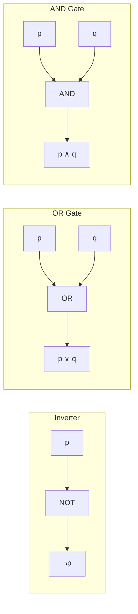

# Chapter 1: The Foundations: Logic and Proofs

The rules of logic specify the meaning of mathematical statements. For instance, these rules help us understand and reason with statements such as “There exists an integer that is not the sum of two squares” and “For every positive integer $n$, the sum of the positive integers not exceeding $n$ is $n(n + 1)/2$.” Logic is the basis of all mathematical reasoning, and of all automated reasoning. It has practical applications to the design of computing machines, to the specification of systems, to artificial intelligence, to computer programming, to programming languages, and to other areas of computer science, as well as to many other fields of study.

To understand mathematics, we must understand what makes up a correct mathematical argument, that is, a proof. Once we prove a mathematical statement is true, we call it a theorem. A collection of theorems on a topic organize what we know about this topic. To learn a mathematical topic, a person needs to actively construct mathematical arguments on this topic, and not just read exposition. Moreover, knowing the proof of a theorem often makes it possible to modify the result to fit new situations.

Everyone knows that proofs are important throughout mathematics, but many people find it surprising how important proofs are in computer science. In fact, proofs are used to verify that computer programs produce the correct output for all possible input values, to show that algorithms always produce the correct result, to establish the security of a system, and to create artificial intelligence. Furthermore, automated reasoning systems have been created to allow computers to construct their own proofs.

In this chapter, we will explain what makes up a correct mathematical argument and introduce tools to construct these arguments. We will develop an arsenal of different proof methods that will enable us to prove many different types of results. After introducing many different methods of proof, we will introduce several strategies for constructing proofs. We will introduce the notion of a conjecture and explain the process of developing mathematics by studying conjectures.

---

## 1.1 Propositional Logic

### 1.1.1 Introduction
The rules of logic give precise meaning to mathematical statements. These rules are used to distinguish between valid and invalid mathematical arguments. Because a major goal of this book is to teach the reader how to understand and how to construct correct mathematical arguments, we begin our study of discrete mathematics with an introduction to logic.

Besides the importance of logic in understanding mathematical reasoning, logic has numerous applications to computer science. These rules are used in the design of computer circuits, the construction of computer programs, the verification of the correctness of programs, and in many other ways. Furthermore, software systems have been developed for constructing some, but not all, types of proofs automatically. We will discuss these applications of logic in this and later chapters.

### 1.1.2 Propositions
Our discussion begins with an introduction to the basic building blocks of logic—propositions.

> **Definition 1**  
> A **proposition** is a declarative sentence (that is, a sentence that declares a fact) that is either true or false, but not both.

#### EXAMPLE 1
All the following declarative sentences are propositions.
1. Washington, D.C., is the capital of the United States of America.
2. Toronto is the capital of Canada.
3. $1 + 1 = 2$.
4. $2 + 2 = 3$.

**Solution:** Propositions 1 and 3 are true, whereas 2 and 4 are false. $\blacktriangleleft$

Some sentences that are not propositions are given in Example 2.

#### EXAMPLE 2
Consider the following sentences.
1. What time is it?
2. Read this carefully.
3. $x + 1 = 2$.
4. $x + y = z$.

**Solution:** Sentences 1 and 2 are not propositions because they are not declarative sentences. Sentences 3 and 4 are not propositions because they are neither true nor false. Note that each of sentences 3 and 4 can be turned into a proposition if we assign values to the variables. We will also discuss other ways to turn sentences such as these into propositions in Section 1.4. $\blacktriangleleft$

We use letters to denote **propositional variables** (or **sentential variables**), that is, variables that represent propositions, just as letters are used to denote numerical variables. The conventional letters used for propositional variables are $p, q, r, s, \dots$. The **truth value** of a proposition is true, denoted by $\text{T}$, if it is a true proposition, and the truth value of a proposition is false, denoted by $\text{F}$, if it is a false proposition. Propositions that cannot be expressed in terms of simpler propositions are called **atomic propositions**.

The area of logic that deals with propositions is called the **propositional calculus** or **propositional logic**. It was first developed systematically by the Greek philosopher Aristotle more than 2300 years ago.

> **ARISTOTLE (384 B.C.E.–322 B.C.E.)**  
> Aristotle was born in Stagirus (Stagira) in northern Greece. His father was the personal physician of the King of Macedonia. Because his father died when Aristotle was young, Aristotle could not follow the custom of following his father’s profession. Aristotle became an orphan at a young age when his mother also died. His guardian who raised him taught him poetry, rhetoric, and Greek. At the age of 17, his guardian sent him to Athens to further his education. Aristotle joined Plato’s Academy, where for 20 years he attended Plato’s lectures, later presenting his own lectures on rhetoric. When Plato died in 347 B.C.E., Aristotle was not chosen to succeed him because his views differed too much from those of Plato. Instead, Aristotle joined the court of King Hermeas where he remained for three years, and married the niece of the King. When the Persians defeated Hermeas, Aristotle moved to Mytilene and, at the invitation of King Philip of Macedonia, he tutored Alexander, Philip’s son, who later became Alexander the Great. Aristotle tutored Alexander for five years and after the death of King Philip, he returned to Athens and set up his own school, called the Lyceum.  
> Aristotle’s followers were called the peripatetics, which means “to walk about,” because Aristotle often walked around as he discussed philosophical questions. Aristotle taught at the Lyceum for 13 years where he lectured to his advanced students in the morning and gave popular lectures to a broad audience in the evening. When Alexander the Great died in 323 B.C.E., a backlash against anything related to Alexander led to trumped-up charges of impiety against Aristotle. Aristotle fled to Chalcis to avoid prosecution. He only lived one year in Chalcis, dying of a stomach ailment in 322 B.C.E.  
> Aristotle wrote three types of works: those written for a popular audience, compilations of scientific facts, and systematic treatises. The systematic treatises included works on logic, philosophy, psychology, physics, and natural history. Aristotle’s writings were preserved by a student and were hidden in a vault where a wealthy book collector discovered them about 200 years later. They were taken to Rome, where they were studied by scholars and issued in new editions, preserving them for posterity.

We now turn our attention to methods for producing new propositions from those that we already have. These methods were discussed by the English mathematician George Boole in 1854 in his book *The Laws of Thought*. Many mathematical statements are constructed by combining one or more propositions. New propositions, called **compound propositions**, are formed from existing propositions using **logical operators**.

> **Definition 1**  
> Let $p$ be a proposition. The **negation** of $p$, denoted by $\neg p$ (also denoted by $\overline{p}$), is the statement  
> “It is not the case that $p$.”  
> The proposition $\neg p$ is read “not $p$.” The truth value of the negation of $p$, $\neg p$, is the opposite of the truth value of $p$.

*Remark:* The notation for the negation operator is not standardized. Although $\neg p$ and $\overline{p}$ are the most common notations used in mathematics to express the negation of $p$, other notations you might see are $\sim p, -p, p', Np$, and $!p$.

#### EXAMPLE 3
Find the negation of the proposition “Michael’s PC runs Linux” and express this in simple English.  
**Solution:** The negation is “It is not the case that Michael’s PC runs Linux.” This negation can be more simply expressed as “Michael’s PC does not run Linux.” $\blacktriangleleft$

#### EXAMPLE 4
Find the negation of the proposition “Vandana’s smartphone has at least 32 GB of memory” and express this in simple English.  
**Solution:** The negation is “It is not the case that Vandana’s smartphone has at least 32 GB of memory.” This negation can also be expressed as “Vandana’s smartphone does not have at least 32 GB of memory” or even more simply as “Vandana’s smartphone has less than 32 GB of memory.” $\blacktriangleleft$

##### TABLE 1: The Truth Table for the Negation of a Proposition.
| $p$ | $\neg p$ |
| :---: | :---: |
| T | F |
| F | T |

Table 1 displays the truth table for the negation of a proposition $p$. This table has a row for each of the two possible truth values of $p$. Each row shows the truth value of $\neg p$ corresponding to the truth value of $p$ for this row.

The negation of a proposition can also be considered the result of the operation of the negation operator on a proposition. The negation operator constructs a new proposition from a single existing proposition. We will now introduce the logical operators that are used to form new propositions from two or more existing propositions. These logical operators are also called **connectives**.

> **Definition 2**  
> Let $p$ and $q$ be propositions. The **conjunction** of $p$ and $q$, denoted by $p \land q$, is the proposition “$p$ and $q$.” The conjunction $p \land q$ is true when both $p$ and $q$ are true and is false otherwise.

Table 2 displays the truth table of $p \land q$. This table has a row for each of the four possible combinations of truth values of $p$ and $q$.

Note that in logic the word “but” sometimes is used instead of “and” in a conjunction. For example, the statement “The sun is shining, but it is raining” is another way of saying “The sun is shining and it is raining.”

#### EXAMPLE 5
Find the conjunction of the propositions $p$ and $q$ where $p$ is the proposition “Rebecca’s PC has more than 16 GB free hard disk space” and $q$ is the proposition “The processor in Rebecca’s PC runs faster than 1 GHz.”  
**Solution:** The conjunction of these propositions, $p \land q$, is the proposition “Rebecca’s PC has more than 16 GB free hard disk space, and the processor in Rebecca’s PC runs faster than 1 GHz.” This conjunction can be expressed more simply as “Rebecca’s PC has more than 16 GB free hard disk space, and its processor runs faster than 1 GHz.” For this conjunction to be true, both conditions given must be true. It is false when one or both of these conditions are false. $\blacktriangleleft$

> **Definition 3**  
> Let $p$ and $q$ be propositions. The **disjunction** of $p$ and $q$, denoted by $p \lor q$, is the proposition “$p$ or $q$.” The disjunction $p \lor q$ is false when both $p$ and $q$ are false and is true otherwise.

| TABLE 2 The Truth Table for the Conjunction of Two Propositions | | | TABLE 3 The Truth Table for the Disjunction of Two Propositions | | |
| :---: | :---: | :---: | :---: | :---: | :---: |
| $p$ | $q$ | $p \land q$ | $p$ | $q$ | $p \lor q$ |
| T | T | T | T | T | T |
| T | F | F | T | F | T |
| F | T | F | F | T | T |
| F | F | F | F | F | F |

The use of the connective *or* in a disjunction corresponds to one of the two ways the word *or* is used in English, namely, as an **inclusive or**. A disjunction is true when at least one of the two propositions is true.

#### EXAMPLE 6
Translate the statement “Students who have taken calculus or introductory computer science can take this class” into a statement in propositional logic using the propositions $p$: “A student who has taken calculus can take this class” and $q$: “A student who has taken introductory computer science can take this class.”  
**Solution:** $p \lor q$. $\blacktriangleleft$

#### EXAMPLE 7
What is the disjunction of the propositions $p$ and $q$, where $p$ and $q$ are the same propositions as in Example 5?  
**Solution:** The disjunction of $p$ and $q$, $p \lor q$, is “Rebecca’s PC has at least 16 GB free hard disk space, or the processor in Rebecca’s PC runs faster than 1 GHz.” $\blacktriangleleft$

> **Definition 4**  
> Let $p$ and $q$ be propositions. The **exclusive or** of $p$ and $q$, denoted by $p \oplus q$ (or $p \text{ XOR } q$), is the proposition that is true when exactly one of $p$ and $q$ is true and is false otherwise.

> **GEORGE BOOLE (1815–1864)**  
> George Boole, the son of a cobbler, was born in Lincoln, England, in November 1815. Because of his family’s difficult financial situation, Boole struggled to educate himself while supporting his family. Nevertheless, he became one of the most important mathematicians of the 1800s. Although he considered a career as a clergyman, he decided instead to go into teaching, and soon afterward opened a school of his own. In his preparation for teaching mathematics, Boole—unsatisfied with textbooks of his day—decided to read the works of the great mathematicians. While reading papers of the great French mathematician Lagrange, Boole made discoveries in the calculus of variations, the branch of analysis dealing with finding curves and surfaces by optimizing certain parameters.  
> In 1848 Boole published *The Mathematical Analysis of Logic*, the first of his contributions to symbolic logic. In 1849 he was appointed professor of mathematics at Queen’s College in Cork, Ireland. In 1854 he published *The Laws of Thought*, his most famous work. In this book, Boole introduced what is now called Boolean algebra in his honor. Boole wrote textbooks on differential equations and on difference equations that were used in Great Britain until the end of the nineteenth century. Boole married in 1855; his wife was the niece of the professor of Greek at Queen’s College. In 1864 Boole died from pneumonia, which he contracted as a result of keeping a lecture engagement even though he was soaking wet from a rainstorm.

##### TABLE 4: The Truth Table for the Exclusive Or of Two Propositions
| $p$ | $q$ | $p \oplus q$ |
| :---: | :---: | :---: |
| T | T | F |
| T | F | T |
| F | T | T |
| F | F | F |

#### EXAMPLE 8
Let $p$ and $q$ be the propositions that state “A student can have a salad with dinner” and “A student can have soup with dinner,” respectively. What is $p \oplus q$?  
**Solution:** $p \oplus q$ is “A student can have soup or salad, but not both, with dinner.” $\blacktriangleleft$

#### EXAMPLE 9
Express the statement “I will use all my savings to travel to Europe or to buy an electric car” in propositional logic using $p$: “I will use all my savings to travel to Europe” and $q$: “I will use all my savings to buy an electric car.”  
**Solution:** $p \oplus q$. $\blacktriangleleft$

### 1.1.3 Conditional Statements

> **Definition 5**  
> Let $p$ and $q$ be propositions. The **conditional statement** $p \to q$ is the proposition “if $p$, then $q$.” The conditional statement $p \to q$ is false when $p$ is true and $q$ is false, and true otherwise. In the conditional statement $p \to q$, $p$ is called the **hypothesis** (or antecedent or premise) and $q$ is called the **conclusion** (or consequence).

##### TABLE 5: The Truth Table for the Conditional Statement $p \to q$
| $p$ | $q$ | $p \to q$ |
| :---: | :---: | :---: |
| T | T | T |
| T | F | F |
| F | T | T |
| F | F | T |

Common ways to express $p \to q$:
- “if $p$, then $q$”
- “if $p, q$”
- “$p$ is sufficient for $q$”
- “$q$ if $p$”
- “$q$ when $p$”
- “a necessary condition for $p$ is $q$”
- “$q$ unless $\neg p$”
- “$p$ implies $q$”
- “$p$ only if $q$”
- “a sufficient condition for $q$ is $p$”
- “$q$ whenever $p$”
- “$q$ is necessary for $p$”
- “$q$ follows from $p$”
- “$q$ provided that $p$”

#### EXAMPLE 10
Let $p$ be the statement “Maria learns discrete mathematics” and $q$ the statement “Maria will find a good job.” Express $p \to q$ as a statement in English.  
**Solution:** “If Maria learns discrete mathematics, then she will find a good job.” $\blacktriangleleft$

#### EXAMPLE 11
What is the value of the variable $x$ after the statement `if 2 + 2 = 4 then x := x + 1` if $x = 0$ before this statement is encountered?  
**Solution:** Because $2 + 2 = 4$ is true, the assignment is executed: $x = 0 + 1 = 1$. $\blacktriangleleft$

#### CONVERSE, CONTRAPOSITIVE, AND INVERSE
For a conditional statement $p \to q$:
- **Converse:** $q \to p$
- **Contrapositive:** $\neg q \to \neg p$ (logically equivalent to $p \to q$)
- **Inverse:** $\neg p \to \neg q$

#### EXAMPLE 12
Find the contrapositive, the converse, and the inverse of “The home team wins whenever it is raining.”  
**Solution:**
- Original: “If it is raining, then the home team wins.”
- Contrapositive: “If the home team does not win, then it is not raining.”
- Converse: “If the home team wins, then it is raining.”
- Inverse: “If it is not raining, then the home team does not win.” $\blacktriangleleft$

### 1.1.4 Biconditionals

> **Definition 6**  
> Let $p$ and $q$ be propositions. The **biconditional statement** $p \leftrightarrow q$ is the proposition “$p$ if and only if $q$.” The biconditional statement $p \leftrightarrow q$ is true when $p$ and $q$ have the same truth values, and is false otherwise. (Also called bi-implications, or written $p \text{ iff } q$.)

##### TABLE 6: The Truth Table for the Biconditional $p \leftrightarrow q$
| $p$ | $q$ | $p \leftrightarrow q$ |
| :---: | :---: | :---: |
| T | T | T |
| T | F | F |
| F | T | F |
| F | F | T |

#### EXAMPLE 13
Let $p$ be “You can take the flight,” and $q$ be “You buy a ticket.” Then $p \leftrightarrow q$ is: “You can take the flight if and only if you buy a ticket.” $\blacktriangleleft$

### 1.1.5 Truth Tables of Compound Propositions

#### EXAMPLE 14
Construct the truth table of $(p \lor \neg q) \to (p \land q)$.

##### TABLE 7: The Truth Table of $(p \lor \neg q) \to (p \land q)$
| $p$ | $q$ | $\neg q$ | $p \lor \neg q$ | $p \land q$ | $(p \lor \neg q) \to (p \land q)$ |
| :---: | :---: | :---: | :---: | :---: | :---: |
| T | T | F | T | T | T |
| T | F | T | T | F | F |
| F | T | F | F | F | T |
| F | F | T | T | F | F |

### 1.1.6 Precedence of Logical Operators

##### TABLE 8: Precedence of Logical Operators
| Operator | Precedence |
| :---: | :---: |
| $\neg$ | 1 |
| $\land$ | 2 |
| $\lor$ | 3 |
| $\to$ | 4 |
| $\leftrightarrow$ | 5 |

### 1.1.7 Logic and Bit Operations

A **bit** is a symbol with two possible values: 0 and 1. 1 represents T (true), 0 represents F (false). A **Boolean variable** has a value of true or false.

##### TABLE 9: Table for the Bit Operators OR, AND, and XOR
| $x$ | $y$ | $x \lor y$ | $x \land y$ | $x \oplus y$ |
| :---: | :---: | :---: | :---: | :---: |
| 0 | 0 | 0 | 0 | 0 |
| 0 | 1 | 1 | 0 | 1 |
| 1 | 0 | 1 | 0 | 1 |
| 1 | 1 | 1 | 1 | 0 |

> **Definition 7**  
> A **bit string** is a sequence of zero or more bits. The **length** of this string is the number of bits in the string.

> **JOHN WILDER TUKEY (1915–2000)**  
> Tukey was born in New Bedford, Massachusetts. He studied at Brown and Princeton, receiving his Ph.D. in topology in 1939. During WWII he worked in statistics at the Fire Control Research Office. In 1945 he joined Princeton and AT&T Bell Laboratories, later founding Princeton's Statistics Department. He is best known for inventing the fast Fourier transform with J. W. Cooley, and coining the terms *bit* and *software*.

#### EXAMPLE 16
Find the bitwise OR, bitwise AND, and bitwise XOR of 01 1011 0110 and 11 0001 1101.  
**Solution:**
```
  01 1011 0110
  11 0001 1101
  ------------
  11 1011 1111  bitwise OR
  01 0001 0100  bitwise AND
  10 1010 1011  bitwise XOR
```
$\blacktriangleleft$

---

## 1.2 Applications of Propositional Logic

### 1.2.1 Introduction & Translating English Sentences

#### EXAMPLE 1
Translate: “You can access the Internet from campus only if you are a computer science major or you are not a freshman.”  
**Solution:** Let $a$: “You can access Internet from campus”, $c$: “CS major”, $f$: “freshman”. Expression: $a \to (c \lor \neg f)$. $\blacktriangleleft$

#### EXAMPLE 2
Translate: “You cannot ride the roller coaster if you are under 4 feet tall unless you are older than 16 years old.”  
**Solution:** $(r \land \neg s) \to \neg q$. $\blacktriangleleft$

### 1.2.2 System Specifications
System specifications must be **consistent** (there is an assignment of truth values making all specifications true).

#### EXAMPLE 4
Determine whether these system specifications are consistent:
1. $p \lor q$ (“diagnostic message is stored in buffer or retransmitted”)
2. $\neg p$ (“diagnostic message is not stored in buffer”)
3. $p \to q$ (“if stored in buffer, then retransmitted”)

**Solution:** Setting $p = \text{F}$ and $q = \text{T}$ satisfies all three statements. Therefore, they are consistent. $\blacktriangleleft$

### 1.2.3 Boolean Searches & Logic Puzzles

#### EXAMPLE 7 (The Three Trunks)
- Trunk 1: “This trunk is empty” ($\neg p_1$)
- Trunk 2: “This trunk is empty” ($\neg p_2$)
- Trunk 3: “The treasure is in Trunk 2” ($p_2$)
Only one inscription is true.  
**Solution:** The treasure is in **Trunk 1** (Trunk 2's inscription is true, Trunks 1 and 3 are false). $\blacktriangleleft$

#### EXAMPLE 8 (Knights and Knaves)
A says: “B is a knight”. B says: “The two of us are opposite types”.  
**Solution:** Both A and B are **knaves**. $\blacktriangleleft$

> **RAYMOND SMULLYAN (1919–2017)**  
> Born in Far Rockaway, New York. Earned his Ph.D. in logic at Princeton in 1959 under Alonzo Church. Taught at Dartmouth, Princeton, Yeshiva, CUNY, and Indiana University. Famous for entertaining and deep books on recreational logic and mathematical philosophy.

### 1.2.4 Logic Circuits
- **Inverter (NOT gate):** Input $p$, Output $\neg p$
- **OR gate:** Inputs $p, q$, Output $p \lor q$
- **AND gate:** Inputs $p, q$, Output $p \land q$



---

## 1.3 Propositional Equivalences

### 1.3.1 Tautologies, Contradictions, and Contingencies
- **Tautology:** A compound proposition that is always true.
- **Contradiction:** A compound proposition that is always false.
- **Contingency:** A compound proposition that is neither a tautology nor a contradiction.

> **Definition 2**  
> $p$ and $q$ are **logically equivalent** ($p \equiv q$ or $p \Leftrightarrow q$) if $p \leftrightarrow q$ is a tautology.

##### TABLE 6: Logical Equivalences
| Equivalence | Name |
| :--- | :--- |
| $p \land \text{T} \equiv p$<br>$p \lor \text{F} \equiv p$ | Identity laws |
| $p \lor \text{T} \equiv \text{T}$<br>$p \land \text{F} \equiv \text{F}$ | Domination laws |
| $p \lor p \equiv p$<br>$p \land p \equiv p$ | Idempotent laws |
| $\neg(\neg p) \equiv p$ | Double negation law |
| $p \lor q \equiv q \lor p$<br>$p \land q \equiv q \land p$ | Commutative laws |
| $(p \lor q) \lor r \equiv p \lor (q \lor r)$<br>$(p \land q) \land r \equiv p \land (q \land r)$ | Associative laws |
| $p \lor (q \land r) \equiv (p \lor q) \land (p \lor r)$<br>$p \land (q \lor r) \equiv (p \land q) \lor (p \land r)$ | Distributive laws |
| $\neg(p \land q) \equiv \neg p \lor \neg q$<br>$\neg(p \lor q) \equiv \neg p \land \neg q$ | De Morgan’s laws |
| $p \lor (p \land q) \equiv p$<br>$p \land (p \lor q) \equiv p$ | Absorption laws |
| $p \lor \neg p \equiv \text{T}$<br>$p \land \neg p \equiv \text{F}$ | Negation laws |

##### TABLE 7: Logical Equivalences Involving Conditional Statements
- $p \to q \equiv \neg p \lor q$
- $p \to q \equiv \neg q \to \neg p$
- $p \lor q \equiv \neg p \to q$
- $p \land q \equiv \neg(p \to \neg q)$
- $\neg(p \to q) \equiv p \land \neg q$
- $(p \to q) \land (p \to r) \equiv p \to (q \land r)$
- $(p \to r) \land (q \to r) \equiv (p \lor q) \to r$
- $(p \to q) \lor (p \to r) \equiv p \to (q \lor r)$
- $(p \to r) \lor (q \to r) \equiv (p \land q) \to r$

##### TABLE 8: Logical Equivalences Involving Biconditionals
- $p \leftrightarrow q \equiv (p \to q) \land (q \to p)$
- $p \leftrightarrow q \equiv \neg p \leftrightarrow \neg q$
- $p \leftrightarrow q \equiv (p \land q) \lor (\neg p \land \neg q)$
- $\neg(p \leftrightarrow q) \equiv p \leftrightarrow \neg q$

> **AUGUSTUS DE MORGAN (1806–1871)**  
> Born in India, educated at Trinity College, Cambridge. Professor of mathematics at University College, London. Made foundational contributions to symbolic logic and coined the term mathematical induction in 1838.

> **AUGUSTA ADA, COUNTESS OF LOVELACE (1815–1852)**  
> Daughter of Lord Byron and Annabella Millbanke. Collaborated with Charles Babbage on the Analytic Engine. Recognized as the first computer programmer; the Ada programming language is named after her.

### 1.3.2 Satisfiability
A compound proposition is **satisfiable** if there is an assignment of truth values to its variables that makes it true. Otherwise, it is **unsatisfiable**.

#### Applications:
1. **$n$-Queens Problem:** Model placing $n$ non-attacking queens on an $n \times n$ chessboard via propositional satisfiability.
2. **Sudoku:** Model 9x9 Sudoku grid rules with 729 variables $p(i, j, n)$ asserting row, column, block, and cell uniqueness.

---

## 1.4 Predicates and Quantifiers

### 1.4.1 Predicates
A statement $P(x)$ is the value of the propositional function $P$ at $x$, where $x$ is the subject and $P$ is the predicate.

### 1.4.2 Quantifiers
- **Universal Quantifier $\forall$:** $\forall x P(x)$ asserts $P(x)$ is true for all $x$ in the domain.
- **Existential Quantifier $\exists$:** $\exists x P(x)$ asserts there exists an $x$ in the domain such that $P(x)$ is true.
- **Uniqueness Quantifier $\exists!$ or $\exists_1$:** $\exists! x P(x)$ asserts there is exactly one $x$ such that $P(x)$ is true.

##### TABLE 1: Quantifiers Summary
| Statement | When True? | When False? |
| :--- | :--- | :--- |
| $\forall x P(x)$ | $P(x)$ is true for every $x$. | There is an $x$ for which $P(x)$ is false. |
| $\exists x P(x)$ | There is an $x$ for which $P(x)$ is true. | $P(x)$ is false for every $x$. |

##### TABLE 2: De Morgan's Laws for Quantifiers
| Negation | Equivalent Statement | When Is Negation True? | When False? |
| :--- | :--- | :--- | :--- |
| $\neg \exists x P(x)$ | $\forall x \neg P(x)$ | For every $x$, $P(x)$ is false. | There is an $x$ for which $P(x)$ is true. |
| $\neg \forall x P(x)$ | $\exists x \neg P(x)$ | There is an $x$ for which $P(x)$ is false. | $P(x)$ is true for every $x$. |

> **CHARLES SANDERS PEIRCE (1839–1914)**  
> American philosopher, logician, and scientist. Made key contributions to mathematical logic, semiotics, pragmatism, and scientific methodology.

---

## 1.5 Nested Quantifiers

Quantifiers are **nested** when one quantifier is within the scope of another (e.g., $\forall x \exists y (x + y = 0)$).

##### TABLE 1: Quantifications of Two Variables
| Statement | When True? | When False? |
| :--- | :--- | :--- |
| $\forall x \forall y P(x, y)$<br>$\forall y \forall x P(x, y)$ | $P(x, y)$ is true for every pair $x, y$. | There is a pair $x, y$ for which $P(x, y)$ is false. |
| $\forall x \exists y P(x, y)$ | For every $x$ there is a $y$ for which $P(x, y)$ is true. | There is an $x$ such that $P(x, y)$ is false for every $y$. |
| $\exists x \forall y P(x, y)$ | There is an $x$ for which $P(x, y)$ is true for every $y$. | For every $x$ there is a $y$ for which $P(x, y)$ is false. |
| $\exists x \exists y P(x, y)$<br>$\exists y \exists x P(x, y)$ | There is a pair $x, y$ for which $P(x, y)$ is true. | $P(x, y)$ is false for every pair $x, y$. |

---

## 1.6 Rules of Inference

An argument is a sequence of statements ending with a conclusion. An argument is **valid** if all premises being true implies the conclusion is true.

##### TABLE 1: Rules of Inference for Propositional Logic
| Rule of Inference | Tautology | Name |
| :--- | :--- | :--- |
| $\begin{aligned} &p \\ &p \to q \\ \hline \therefore &q \end{aligned}$ | $(p \land (p \to q)) \to q$ | Modus ponens |
| $\begin{aligned} &\neg q \\ &p \to q \\ \hline \therefore &\neg p \end{aligned}$ | $(\neg q \land (p \to q)) \to \neg p$ | Modus tollens |
| $\begin{aligned} &p \to q \\ &q \to r \\ \hline \therefore &p \to r \end{aligned}$ | $((p \to q) \land (q \to r)) \to (p \to r)$ | Hypothetical syllogism |
| $\begin{aligned} &p \lor q \\ &\neg p \\ \hline \therefore &q \end{aligned}$ | $((p \lor q) \land \neg p) \to q$ | Disjunctive syllogism |
| $\begin{aligned} &p \\ \hline \therefore &p \lor q \end{aligned}$ | $p \to (p \lor q)$ | Addition |
| $\begin{aligned} &p \land q \\ \hline \therefore &p \end{aligned}$ | $(p \land q) \to p$ | Simplification |
| $\begin{aligned} &p \\ &q \\ \hline \therefore &p \land q \end{aligned}$ | $((p) \land (q)) \to (p \land q)$ | Conjunction |
| $\begin{aligned} &p \lor q \\ &\neg p \lor r \\ \hline \therefore &q \lor r \end{aligned}$ | $((p \lor q) \land (\neg p \lor r)) \to (q \lor r)$ | Resolution |

##### TABLE 2: Rules of Inference for Quantified Statements
| Rule of Inference | Name |
| :--- | :--- |
| $\begin{aligned} &\forall x P(x) \\ \hline \therefore &P(c) \end{aligned}$ | Universal instantiation |
| $\begin{aligned} &P(c) \text{ for an arbitrary } c \\ \hline \therefore &\forall x P(x) \end{aligned}$ | Universal generalization |
| $\begin{aligned} &\exists x P(x) \\ \hline \therefore &P(c) \text{ for some element } c \end{aligned}$ | Existential instantiation |
| $\begin{aligned} &P(c) \text{ for some element } c \\ \hline \therefore &\exists x P(x) \end{aligned}$ | Existential generalization |

---

## 1.7 Introduction to Proofs

### Types of Proofs
1. **Direct Proof:** Assume $p$ is true; deduce that $q$ must be true.
2. **Proof by Contraposition:** To prove $p \to q$, prove $\neg q \to \neg p$.
3. **Proof by Contradiction:** Assume $\neg p$ (or $p \land \neg q$) and deduce a contradiction $r \land \neg r$.
4. **Vacuous Proof:** If premise $p$ is false, $p \to q$ is vacuously true.
5. **Trivial Proof:** If conclusion $q$ is true, $p \to q$ is trivially true.
6. **Proof of Equivalence:** To prove $p \leftrightarrow q$, prove both $p \to q$ and $q \to p$.

---

## 1.8 Proof Methods and Strategy

### Methods:
- **Exhaustive Proof:** Check all individual cases.
- **Proof by Cases:** Exhaustively cover all mutually exclusive/exhaustive subsets.
- **Without Loss of Generality (WLOG):** Exploit symmetry between variables to reduce cases.
- **Existence Proofs:**
  - *Constructive:* Explicitly find a witness element $a$ such that $P(a)$ holds.
  - *Nonconstructive:* Prove $\exists x P(x)$ holds without explicitly producing $a$.
- **Uniqueness Proofs:** Prove existence ($P(x)$) and uniqueness ($P(x) \land P(y) \to x = y$).
- **Forward and Backward Reasoning:** Start from premises or work backward from the conclusion.

> **GODFREY HAROLD HARDY (1877–1947)**  
> Renowned English pure mathematician at Cambridge and Oxford. Mentor and collaborator of Srinivasa Ramanujan and J. E. Littlewood. Author of *A Mathematician’s Apology*.

> **SRINIVASA RAMANUJAN (1887–1920)**  
> Intuitive mathematical genius from India. Discovered thousands of revolutionary identities, modular equations, and partition formulas.

> **ANDREW WILES (born 1953)**  
> English mathematician who proved Fermat's Last Theorem in 1994 using the theory of elliptic curves and modular forms, resolving a 350-year-old conjecture.

---

## Key Terms and Results Summary

- **Proposition:** A statement that is either true or false.
- **Tautology:** Always true compound proposition.
- **Contradiction:** Always false compound proposition.
- **Logically Equivalent:** Propositions $p, q$ where $p \leftrightarrow q$ is a tautology.
- **Modus Ponens:** $(p \land (p \to q)) \to q$.
- **Modus Tollens:** $(\neg q \land (p \to q)) \to \neg p$.
- **De Morgan’s Laws:** $\neg(p \land q) \equiv \neg p \lor \neg q$, $\neg(p \lor q) \equiv \neg p \land \neg q$.
- **Quantifiers:** $\forall$ (Universal), $\exists$ (Existential), $\exists!$ (Unique Existential).
