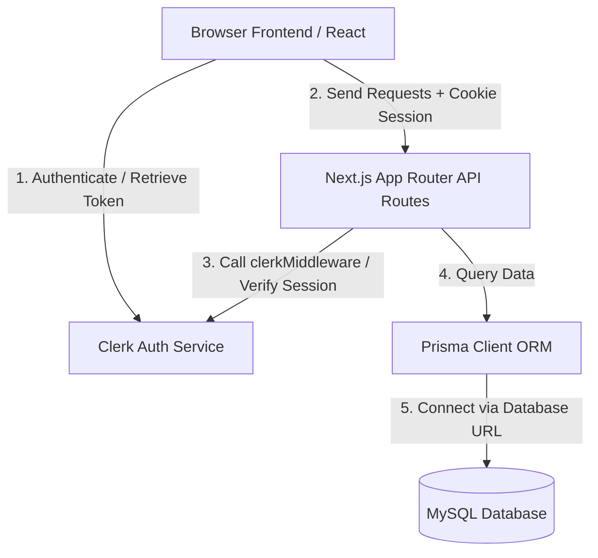
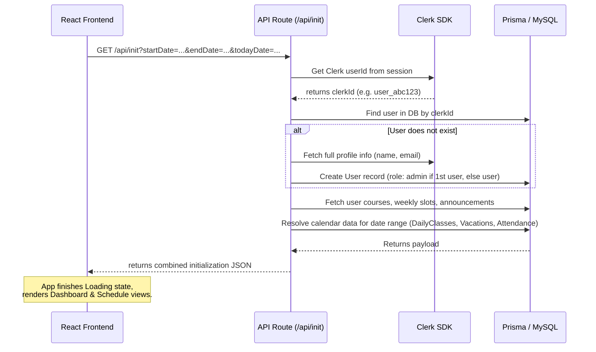
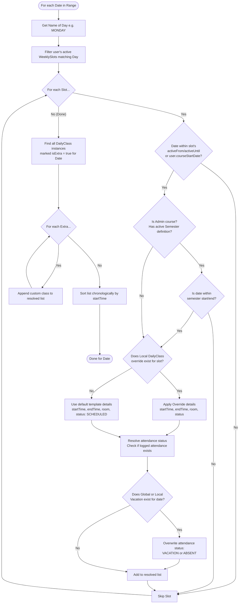

# System Architecture & Lifecycle: Routine Planner

This document provides a technical overview of how the Routine Planner is structured, its authentication integration, the bootstrapping lifecycle, and the core calendar resolution engine.

---

## 1. System Context Diagram

The architecture is built on Next.js (App Router), leveraging Clerk for user management, Prisma as the ORM, and MySQL for persistence.

---

## 2. Bootstrapping Lifecycle (`/api/init`)

When a user visits the website, rather than triggering multiple concurrent API calls (which causes database connection spikes and screen flickering), the application fires a single bootstrap query: `GET /api/init`.

- **File Backlink**: [[api_init]], [[home_page]]

---

## 3. Core Calendar Resolution Engine

The core scheduling logic lies in `src/app/api/calendar/route.ts`. The server resolves weekly recurring schedules into concrete class instances for any given range of dates (`startDate` to `endDate`).

### Algorithm Flowchart

- **File Backlink**: [[api_calendar]]
- **Details**:
  - **Semester Boundary filter**: Applied to courses synced from admin (`source = 'admin'`). Ensures class templates do not generate during summer/winter holidays or exam breaks.
  - **Vacation / Absent Day overrides**: Global vacations (declared by admin) and personal vacations (declared by student) take ultimate precedence. If a vacation falls on a date, classes are kept on the list but marked with status `VACATION` or `ABSENT`, disabling standard attendance triggers.
  - **Custom Extra Classes**: Standalone class instances (`isExtra: true`) are generated manually by the student or pushed by the admin. They bypass weekly slots.
