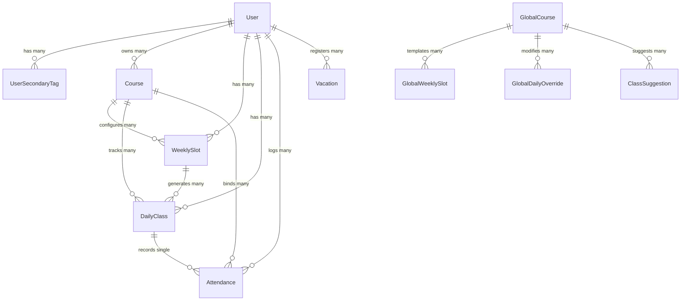

# Prisma Database Schema: Routine Planner

This document provides a comprehensive blueprint of the database layout, individual model definitions, fields, constraints, and relational mappings. The application uses **MySQL** as the backend database, accessed via **Prisma ORM**.

---

## Entity-Relationship Diagram (ERD)

The following Mermaid diagram shows the database entities and how they relate to each other.

---

## User-Level Schema Models

These models represent personal schedules, overrides, vacation logs, and settings unique to each individual student.

### 1. User
Represents a student registered in the system. Authenticated via Clerk.
- **File Backlink**: [[lib_auth]], [[api_user]]
- **Fields**:
  - `id`: `Int` (Auto-increment, Primary Key)
  - `clerkId`: `String` (Unique, maps directly to Clerk User ID)
  - `name`: `String` (Full Name sync from Clerk)
  - `email`: `String` (Defaults to `""`, synced from Clerk primary email)
  - `color`: `String` (Hex color for dashboard theme customization, defaults to `#2b6cb0`)
  - `role`: `String` (Defaults to `"user"`, can be `"admin"` for full control)
  - `university`: `String` (Primary tag e.g. "University of Dhaka")
  - `courseName`: `String` (Primary course tag e.g. "BSSE-18")
  - `courseStartDate`: `String` (ISO date string format `"YYYY-MM-DD"`. Weekly slots begin generating from this date. Defaults to `"2026-01-01"`)
  - `createdAt`: `DateTime` (Defaults to `now()`)

### 2. UserSecondaryTag
Enables students to subscribe to additional courses or classes beyond their primary course/university.
- **Fields**:
  - `id`: `Int` (Auto-increment, PK)
  - `userId`: `Int` (FK to `User.id`, Cascade on Delete)
  - `university`: `String`
  - `courseName`: `String`
- **Unique Constraint**: `@@unique([userId, university, courseName])`

### 3. Course
A personal subject. It can either be created by the user or imported from a `GlobalCourse` template.
- **File Backlink**: [[api_courses]]
- **Fields**:
  - `id`: `Int` (Auto-increment, PK)
  - `userId`: `Int` (FK to `User.id`, Cascade on Delete)
  - `subjectId`: `String` (Subject ID e.g. `"CSE-1101"`)
  - `subjectName`: `String` (Full name e.g. `"Structured Programming"`)
  - `subjectCode`: `String` (Short code e.g. `"CSE-1101"`)
  - `teacherName`: `String`
  - `teacherCode`: `String`
  - `teacherContact`: `String`
  - `teacherEmail`: `String`
  - `source`: `String` (Defaults to `"personal"`. Set to `"admin"` if synced from global template)
  - `isArchived`: `Boolean` (Soft delete flag, defaults to `false`. If true, weekly slots are ignored during calendar calculations)
  - `archivedAt`: `String?` (ISO Date string `"YYYY-MM-DD"` indicating when archiving occurred)
- **Unique Constraint**: `@@unique([userId, subjectId])`

### 4. WeeklySlot
A recurring schedule item (e.g., "Monday at 8:00 AM"). Used to generate individual class instances on the calendar.
- **File Backlink**: [[api_weekly_slots]]
- **Fields**:
  - `id`: `Int` (Auto-increment, PK)
  - `userId`: `Int` (FK to `User.id`, Cascade on Delete)
  - `courseId`: `Int` (FK to `Course.id`, Cascade on Delete)
  - `dayOfWeek`: `String` (Day enum: `"SUNDAY"`, `"MONDAY"`, `"TUESDAY"`, `"WEDNESDAY"`, `"THURSDAY"`, `"FRIDAY"`, `"SATURDAY"`)
  - `startTime`: `String` (Time format `"HH:MM"`)
  - `endTime`: `String` (Time format `"HH:MM"`)
  - `room`: `String?` (Room number/string)
  - `group`: `String?` (e.g. `"Group A"`, `"C1"`)
  - `activeFrom`: `String?` (Optional start date `"YYYY-MM-DD"`)
  - `activeUntil`: `String?` (Optional end date `"YYYY-MM-DD"`)
  - `source`: `String` (Defaults to `"personal"`. Set to `"admin"` if synced from template)

### 5. DailyClass
An override record, extra class, or rescheduling instance. Modifies how a recurring weekly slot resolves on a specific date.
- **File Backlink**: [[api_calendar]]
- **Fields**:
  - `id`: `Int` (Auto-increment, PK)
  - `userId`: `Int` (FK to `User.id`, Cascade on Delete)
  - `courseId`: `Int` (FK to `Course.id`, Cascade on Delete)
  - `weeklySlotId`: `Int?` (FK to `WeeklySlot.id`, null for custom extra classes)
  - `date`: `String` (Date string `"YYYY-MM-DD"`)
  - `startTime`: `String` (`"HH:MM"`)
  - `endTime`: `String` (`"HH:MM"`)
  - `room`: `String?`
  - `group`: `String?`
  - `status`: `String` (Defaults to `"SCHEDULED"`. Can be `"RESCHEDULED"` or `"CANCELLED"`)
  - `isExtra`: `Boolean` (Defaults to `false`. True for custom extra classes)
  - `description`: `String?` (e.g., "Midterm exam", "Wear formal dress")

### 6. Attendance
Tracks attendance on individual class instances.
- **File Backlink**: [[api_attendance]]
- **Fields**:
  - `id`: `Int` (Auto-increment, PK)
  - `userId`: `Int` (FK to `User.id`, Cascade on Delete)
  - `courseId`: `Int` (FK to `Course.id`, Cascade on Delete)
  - `date`: `String` (`"YYYY-MM-DD"`)
  - `status`: `String` (Enum value: `"PRESENT"`, `"ABSENT"`, `"CANCELLED"`)
  - `weeklySlotId`: `Int?`
  - `dailyClassId`: `Int?` (FK to `DailyClass.id`)
- **Unique Constraint**: `@@unique([userId, courseId, date, weeklySlotId, dailyClassId])`

### 7. Vacation
A personal holiday or sick day logged by a user.
- **File Backlink**: [[api_vacations]]
- **Fields**:
  - `id`: `Int` (Auto-increment, PK)
  - `userId`: `Int` (FK to `User.id`, Cascade on Delete)
  - `date`: `String` (`"YYYY-MM-DD"`)
  - `type`: `String` (Enum value: `"VACATION"` or `"ABSENT_DAY"`)
  - `description`: `String?`
- **Unique Constraint**: `@@unique([userId, date])`

---

## Global Admin Schema Models

These models are managed by administrators to create schedule templates that apply to entire batches or tag categories.

### 8. GlobalCourse
A shared subject template tagged with a university and course tags.
- **File Backlink**: [[api_admin_global_courses]]
- **Fields**:
  - `id`: `Int` (Auto-increment, PK)
  - `subjectId`: `String` (Subject ID e.g. `"CSE-1101"`)
  - `subjectName`: `String`
  - `subjectCode`: `String`
  - `teacherName`: `String`
  - `teacherCode`: `String`
  - `teacherContact`: `String`
  - `teacherEmail`: `String`
  - `university`: `String`
  - `courseName`: `String`
- **Unique Constraint**: `@@unique([subjectId, university, courseName])`

### 9. GlobalWeeklySlot
A recurring schedule item inside a global course template.
- **File Backlink**: [[api_admin_global_slots]]
- **Fields**:
  - `id`: `Int` (Auto-increment, PK)
  - `globalCourseId`: `Int` (FK to `GlobalCourse.id`, Cascade on Delete)
  - `dayOfWeek`: `String` (`"SUNDAY"`, `"MONDAY"`, etc.)
  - `startTime`: `String` (`"HH:MM"`)
  - `endTime`: `String` (`"HH:MM"`)
  - `room`: `String?`
  - `group`: `String?`

### 10. GlobalDailyOverride
An override declared by an admin for a template course that applies to all subscribed students (e.g. class cancelled due to rain).
- **File Backlink**: [[api_admin_global_overrides]]
- **Fields**:
  - `id`: `Int` (Auto-increment, PK)
  - `globalCourseId`: `Int` (FK to `GlobalCourse.id`, Cascade on Delete)
  - `date`: `String` (`"YYYY-MM-DD"`)
  - `status`: `String` (Defaults to `"CANCELLED"`. Can be `"RESCHEDULED"`)
  - `newStartTime`: `String?`
  - `newEndTime`: `String?`
  - `newRoom`: `String?`
  - `description`: `String?`
- **Unique Constraint**: `@@unique([globalCourseId, date])`

### 11. GlobalVacation
An admin-declared holiday (e.g., Independence Day). Automatically cancels classes for matching tag groups.
- **File Backlink**: [[api_admin_global_vacations]]
- **Fields**:
  - `id`: `Int` (Auto-increment, PK)
  - `date`: `String` (`"YYYY-MM-DD"`)
  - `type`: `String` (Defaults to `"VACATION"`)
  - `description`: `String?`
  - `university`: `String?` (Null represents global holidays applying to all universities)
  - `courseName`: `String?` (Null represents all courses within that university)
- **Unique Constraint**: `@@unique([date, university, courseName])`

### 12. Semester
Defines start and end dates for academic semesters by tag groups. Classes from global templates are generated only within active semesters.
- **File Backlink**: [[api_admin_semesters]]
- **Fields**:
  - `id`: `Int` (Auto-increment, PK)
  - `name`: `String` (e.g., `"Spring 2026"`)
  - `startDate`: `String` (`"YYYY-MM-DD"`)
  - `endDate`: `String` (`"YYYY-MM-DD"`)
  - `university`: `String`
  - `courseName`: `String`
  - `isActive`: `Boolean` (Defaults to `true`)
- **Unique Constraint**: `@@unique([name, university, courseName])`

### 13. Announcement
A broadcast notification shown on the dashboard of users who match the tag filters.
- **File Backlink**: [[api_admin_announcements]], [[api_announcements]]
- **Fields**:
  - `id`: `Int` (Auto-increment, PK)
  - `title`: `String`
  - `body`: `String` (Stored as MySQL `Text`)
  - `university`: `String?` (Null indicates broadcast to all universities)
  - `courseName`: `String?` (Null indicates broadcast to all courses)
  - `expiresAt`: `String?` (`"YYYY-MM-DD"`, optional)
  - `createdAt`: `DateTime` (Defaults to `now()`)

### 14. ClassSuggestion
A modification suggested by a user for a global course template (e.g. rescheduling request due to exams). Admins can approve or reject suggestions.
- **File Backlink**: [[api_suggestions]], [[api_admin_suggestions]]
- **Fields**:
  - `id`: `Int` (Auto-increment, PK)
  - `globalCourseId`: `Int` (FK to `GlobalCourse.id`, Cascade on Delete)
  - `date`: `String` (`"YYYY-MM-DD"`)
  - `suggestedStatus`: `String` (`"CANCELLED"` or `"RESCHEDULED"`)
  - `newStartTime`: `String?`
  - `newEndTime`: `String?`
  - `newRoom`: `String?`
  - `reason`: `String?` (Stored as MySQL `Text`)
  - `suggestedByUserIds`: `String` (JSON array string containing IDs of users who agreed, e.g. `"[1, 3]"`)
  - `suggestedByNames`: `String` (JSON array string containing names of matching users, e.g. `["John", "Doe"]`)
  - `status`: `String` (Defaults to `"PENDING"`. Can be `"APPROVED"` or `"REJECTED"`)
  - `createdAt`: `DateTime` (Defaults to `now()`)
  - `updatedAt`: `DateTime` (Automatically set on update)
- **Unique Constraint**: `@@unique([globalCourseId, date])`
