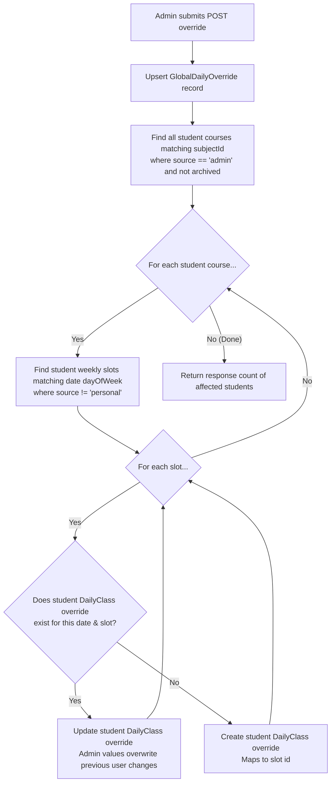

# Admin API: Master Overrides Manager

This endpoint handles administrative modifications (cancellations and rescheduling overrides) that immediately propagate to all students subscribed to the target course template, located at `src/app/api/admin/global-overrides/route.ts`.

- **File Link**: [route.ts](file:///d:/02_CODE/04_TEST/Routine/src/app/api/admin/global-overrides/route.ts)
- **Backlinks**: [[index]], [[component_admin_panel]], [[admin_api]], [[api_calendar]]

---

## 1. GET `/api/admin/global-overrides`

- **Purpose**: Lists all active global template overrides.
- **Authentication**: Required (`Admin` role check)
- **URL Query Parameters**:
  - `globalCourseId` (`Int`, Optional): Filter to overrides of a specific template.
- **Success Response JSON**:
  ```json
  [
    {
      "id": 1,
      "globalCourseId": 1,
      "date": "2026-07-06",
      "status": "CANCELLED",
      "newStartTime": null,
      "newEndTime": null,
      "newRoom": null,
      "description": "Eid Holiday",
      "globalCourse": {
        "subjectId": "CSE-1101",
        "subjectName": "Structured Programming",
        "subjectCode": "CSE-1101"
      }
    }
  ]
  ```

---

## 2. POST `/api/admin/global-overrides`

- **Purpose**: Declares a new override (cancellation or rescheduling) that updates student calendars in real time.
- **Authentication**: Required (`Admin` role check)
- **JSON Payload Parameters**:
  - `globalCourseId` (`Int`, Required): Global course identifier.
  - `date` (`YYYY-MM-DD`, Required): Target date of the override.
  - `status` (`String`, Optional): `"CANCELLED"` or `"RESCHEDULED"`. Defaults to `"CANCELLED"`.
  - `newStartTime` & `newEndTime` (`String` format `"HH:MM"`, Required if rescheduled).
  - `newRoom` & `description` strings.

### Propagation Logic:


1. **Upsert Global Record**: Upserts the `GlobalDailyOverride` record.
2. **Find Subscribed Students**: Queries the `Course` table for all non-archived courses with matching `subjectId` and `source: 'admin'`.
3. **Parse Target Day**: Determines the weekday name (e.g. `"MONDAY"`) from the target date.
4. **Student Override Insertion**:
   - Loops through each student course and filters weekly slots matching the day of the week (excluding personal slots, which are protected).
   - For each matching slot:
     - **If user override exists**: Overwrites it with the new admin override settings, appending `[Admin]` to the description. Admin settings take priority.
     - **If no override exists**: Creates a new `DailyClass` override record mapped to the slot and user.

---

## 3. DELETE `/api/admin/global-overrides`

- **Purpose**: Deletes a global override record.
- **Authentication**: Required (`Admin` role check)
- **URL Query Parameters**:
  - `id` (`Int`, Required): Record identifier key.
- **Success Response JSON**:
  ```json
  { "success": true }
  ```
- **Note**: Deleting the global override row does NOT automatically clean up the pushed `DailyClass` records on the students' tables; they remain as decoupled instances. To force refresh student timelines back to template parameters, admins trigger a **Push Sync** (see [[api_admin_push_sync]]).

---

## 4. Implementation Code Breakdown

The source code in `src/app/api/admin/global-overrides/route.ts` is split into the following phases:

### Phase 1: GET Request (Fetch Overrides)
Fetches all global overrides from the database, incorporating course blueprints details.

```typescript
import { NextRequest, NextResponse } from 'next/server';
import { requireAdmin } from '@/lib/auth';
import { prisma } from '@/lib/prisma';

export async function GET(req: NextRequest) {
  try {
    await requireAdmin();

    const { searchParams } = new URL(req.url);
    const globalCourseId = searchParams.get('globalCourseId');

    const where: any = {};
    if (globalCourseId) where.globalCourseId = parseInt(globalCourseId);

    const overrides = await prisma.globalDailyOverride.findMany({
      where,
      include: {
        globalCourse: {
          select: { subjectId: true, subjectName: true, subjectCode: true, university: true, courseName: true },
        },
      },
      orderBy: { date: 'desc' },
    });

    return NextResponse.json(overrides);
  } catch (error: any) {
    if (error.message === 'Forbidden: Admin access required') {
      return NextResponse.json({ error: 'Forbidden' }, { status: 403 });
    }
    if (error.message === 'Unauthorized: No authenticated user') {
      return NextResponse.json({ error: 'Unauthorized' }, { status: 401 });
    }
    console.error('Error fetching global overrides:', error);
    return NextResponse.json({ error: error.message }, { status: 500 });
  }
}
```

---

### Phase 2: POST Request - Global Override Record Upsert
Checks permissions and upserts the `GlobalDailyOverride` record storing the change.

```typescript
export async function POST(req: NextRequest) {
  try {
    await requireAdmin();

    const { globalCourseId, date, status, newStartTime, newEndTime, newRoom, description } = await req.json();

    if (!globalCourseId || !date) {
      return NextResponse.json({ error: 'Global course ID and date are required' }, { status: 400 });
    }

    const overrideStatus = status || 'CANCELLED';

    // Create/update the global override record
    const override = await prisma.globalDailyOverride.upsert({
      where: {
        globalCourseId_date: {
          globalCourseId: parseInt(globalCourseId),
          date,
        },
      },
      create: {
        globalCourseId: parseInt(globalCourseId),
        date,
        status: overrideStatus,
        newStartTime: overrideStatus === 'RESCHEDULED' ? newStartTime : null,
        newEndTime: overrideStatus === 'RESCHEDULED' ? newEndTime : null,
        newRoom: newRoom || null,
        description: description || null,
      },
      update: {
        status: overrideStatus,
        newStartTime: overrideStatus === 'RESCHEDULED' ? newStartTime : null,
        newEndTime: overrideStatus === 'RESCHEDULED' ? newEndTime : null,
        newRoom: newRoom || null,
        description: description || null,
      },
    });
```

---

### Phase 3: POST Request - Real-time Calendars Propagation
Identifies all students currently subscribed to the course template and inserts/updates a personalized override (`DailyClass`) record in their calendars.

```typescript
    const globalCourse = await prisma.globalCourse.findUnique({
      where: { id: parseInt(globalCourseId) },
    });

    if (!globalCourse) {
      return NextResponse.json({ error: 'Global course not found' }, { status: 404 });
    }

    // Find all student course copies
    const userCourses = await prisma.course.findMany({
      where: {
        subjectId: globalCourse.subjectId,
        source: 'admin',
        isArchived: false,
      },
      include: {
        weeklySlots: true,
      },
    });

    const dateObj = new Date(date + 'T00:00:00');
    const dayNames = ['SUNDAY', 'MONDAY', 'TUESDAY', 'WEDNESDAY', 'THURSDAY', 'FRIDAY', 'SATURDAY'];
    const dayOfWeek = dayNames[dateObj.getDay()];

    let overridesApplied = 0;

    for (const course of userCourses) {
      // Find matching slots on this weekday (excluding personal custom slots)
      const matchingSlots = course.weeklySlots.filter(s => s.dayOfWeek === dayOfWeek && s.source !== 'personal');

      for (const slot of matchingSlots) {
        const existing = await prisma.dailyClass.findFirst({
          where: {
            userId: course.userId,
            courseId: course.id,
            date,
            weeklySlotId: slot.id,
          },
        });

        if (existing) {
          // Update student override (admin values take priority)
          await prisma.dailyClass.update({
            where: { id: existing.id },
            data: {
              status: overrideStatus,
              startTime: overrideStatus === 'RESCHEDULED' && newStartTime ? newStartTime : slot.startTime,
              endTime: overrideStatus === 'RESCHEDULED' && newEndTime ? newEndTime : slot.endTime,
              room: newRoom || slot.room,
              description: description ? `[Admin] ${description}` : existing.description,
            },
          });
        } else {
          // Create new student override record
          await prisma.dailyClass.create({
            data: {
              userId: course.userId,
              courseId: course.id,
              weeklySlotId: slot.id,
              date,
              startTime: overrideStatus === 'RESCHEDULED' && newStartTime ? newStartTime : slot.startTime,
              endTime: overrideStatus === 'RESCHEDULED' && newEndTime ? newEndTime : slot.endTime,
              room: newRoom || slot.room,
              group: slot.group,
              status: overrideStatus,
              isExtra: false,
              description: description ? `[Admin] ${description}` : null,
            },
          });
        }
        overridesApplied++;
      }
    }

    return NextResponse.json({
      success: true,
      override,
      overridesApplied,
      coursesAffected: userCourses.length,
    });
  } catch (error: any) {
    if (error.message === 'Forbidden: Admin access required') {
      return NextResponse.json({ error: 'Forbidden' }, { status: 403 });
    }
    if (error.message === 'Unauthorized: No authenticated user') {
      return NextResponse.json({ error: 'Unauthorized' }, { status: 401 });
    }
    console.error('Error creating global override:', error);
    return NextResponse.json({ error: error.message }, { status: 500 });
  }
}
```

---

### Phase 4: DELETE Request (Remove Global Override)
Deletes the global override settings record.

```typescript
export async function DELETE(req: NextRequest) {
  try {
    await requireAdmin();

    const { searchParams } = new URL(req.url);
    const id = parseInt(searchParams.get('id') || '');

    if (!id) {
      return NextResponse.json({ error: 'Override ID is required' }, { status: 400 });
    }

    await prisma.globalDailyOverride.delete({ where: { id } });
    return NextResponse.json({ success: true });
  } catch (error: any) {
    if (error.message === 'Forbidden: Admin access required') {
      return NextResponse.json({ error: 'Forbidden' }, { status: 403 });
    }
    if (error.message === 'Unauthorized: No authenticated user') {
      return NextResponse.json({ error: 'Unauthorized' }, { status: 401 });
    }
    console.error('Error deleting global override:', error);
    return NextResponse.json({ error: error.message }, { status: 500 });
  }
}
```
