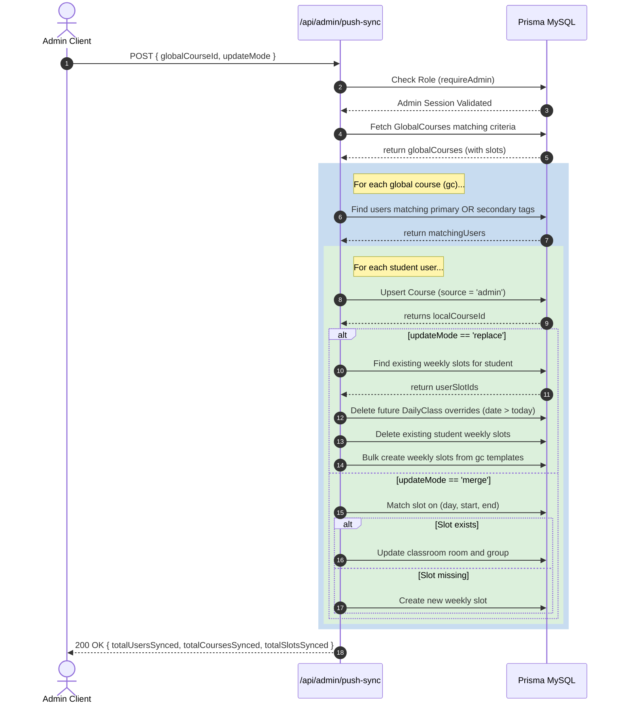

# Admin API: Timetable Templates Push Sync

This endpoint pushes global course schedule templates and slots to matching students' active personal calendars, located at `src/app/api/admin/push-sync/route.ts`.

- **File Link**: [route.ts](file:///d:/02_CODE/04_TEST/Routine/src/app/api/admin/push-sync/route.ts)
- **Backlinks**: [[index]], [[component_admin_panel]], [[admin_api]]

---

## 1. GET `/api/admin/push-sync`

- **Purpose**: Previews the list of students who will be affected if a push sync is executed under matching tag conditions.
- **Authentication**: Required (`Admin` role check)
- **URL Query Parameters**:
  - `university` & `courseName` (`String`, Optional): Filters preview matching.
- **Success Response JSON**:
  ```json
  {
    "count": 1,
    "users": [
      {
        "id": 1,
        "name": "Jane Doe",
        "email": "user@gmail.com",
        "university": "DU",
        "courseName": "BSSE-18"
      }
    ]
  }
  ```

---

## 2. POST `/api/admin/push-sync`

- **Purpose**: Automatically propagates course templates and slot matrices to students.
- **Authentication**: Required (`Admin` role check)
- **JSON Payload Parameters**:
  - `globalCourseId` (`Int`, Optional): Sync only a specific global course.
  - `university` & `courseName` (`String`, Optional): Batch filter.
  - `updateMode` (`String`, Optional): Mode is either `"merge"` (default) or `"replace"`.
  - `userIds` (`Array` of `Int`, Optional): If provided, runs sync only on these user accounts.

### Timetable Sync Modes:
1. **`merge`**:
   - Matches global slots to student slots by unique combination `(dayOfWeek, startTime, endTime)`.
   - Creates slots if they are missing.
   - If slots exist, updates fields (classroom `room`, `group`) without deleting historical student records.
2. **`replace`**:
   - Deletes all existing student weekly slots for this course.
   - **Historical Safety Step**: Before wiping the slots, queries existing slot IDs and deletes **future overrides only** (`date > today`). Past overrides are preserved to protect student attendance record histories.
   - Recreates student weekly slots from global templates.

---

## 3. Push Sync Sequence Diagram

This diagram displays the workflow when an administrator triggers a synchronization:



---

## 4. Source Code

Here is the complete implementation of `src/app/api/admin/push-sync/route.ts`:

```typescript
import { NextRequest, NextResponse } from 'next/server';
import { requireAdmin } from '@/lib/auth';
import { prisma } from '@/lib/prisma';
import { normalizeTag } from '@/lib/utils';

// POST: Admin pushes global course templates to all matching students
export async function POST(req: NextRequest) {
  try {
    await requireAdmin();

    const body = await req.json();
    const { globalCourseId, university, courseName, updateMode, userIds } = body;
    const syncMode = updateMode || 'merge'; // 'merge' (default) or 'replace'

    // Build filter for global courses
    const courseFilter: any = {};
    if (globalCourseId) {
      courseFilter.id = globalCourseId;
    }
    if (university !== undefined) {
      courseFilter.university = normalizeTag(university);
    }
    if (courseName !== undefined) {
      courseFilter.courseName = normalizeTag(courseName);
    }

    // Fetch matching global courses
    const globalCourses = await prisma.globalCourse.findMany({
      where: courseFilter,
      include: { weeklySlots: true },
    });

    if (globalCourses.length === 0) {
      return NextResponse.json({ error: 'No matching global courses found' }, { status: 404 });
    }

    let totalUsersSynced = 0;
    let totalCoursesSynced = 0;
    let totalSlotsSynced = 0;

    for (const gc of globalCourses) {
      let matchingUsers;
      if (userIds && Array.isArray(userIds) && userIds.length > 0) {
        matchingUsers = await prisma.user.findMany({
          where: { id: { in: userIds.map((id: any) => parseInt(id)) } },
        });
      } else {
        matchingUsers = await findMatchingUsers(gc.university, gc.courseName);
      }

      for (const user of matchingUsers) {
        let localCourse = await prisma.course.findUnique({
          where: {
            userId_subjectId: {
              userId: user.id,
              subjectId: gc.subjectId,
            },
          },
        });

        if (!localCourse) {
          localCourse = await prisma.course.create({
            data: {
              userId: user.id,
              subjectId: gc.subjectId,
              subjectName: gc.subjectName,
              subjectCode: gc.subjectCode,
              teacherName: gc.teacherName,
              teacherCode: gc.teacherCode,
              teacherContact: gc.teacherContact,
              teacherEmail: gc.teacherEmail,
              source: 'admin',
              isArchived: false,
            },
          });
          totalCoursesSynced++;
        } else {
          localCourse = await prisma.course.update({
            where: { id: localCourse.id },
            data: {
              subjectName: gc.subjectName,
              subjectCode: gc.subjectCode,
              teacherName: gc.teacherName,
              teacherCode: gc.teacherCode,
              teacherContact: gc.teacherContact,
              teacherEmail: gc.teacherEmail,
              source: 'admin',
              isArchived: false,
              archivedAt: null,
            },
          });
          totalCoursesSynced++;
        }

        // Sync weekly slots
        if (syncMode === 'replace') {
          const existingSlots = await prisma.weeklySlot.findMany({
            where: { userId: user.id, courseId: localCourse.id },
          });

          // Delete future DailyClass records linked to these slots
          const todayStr = new Date().toISOString().split('T')[0];
          for (const es of existingSlots) {
            await prisma.dailyClass.deleteMany({
              where: {
                weeklySlotId: es.id,
                userId: user.id,
                date: { gt: todayStr },
              },
            });
          }

          // Delete all existing weekly slots for this course
          await prisma.weeklySlot.deleteMany({
            where: { userId: user.id, courseId: localCourse.id },
          });

          // Recreate from global template
          for (const gs of gc.weeklySlots) {
            await prisma.weeklySlot.create({
              data: {
                userId: user.id,
                courseId: localCourse.id,
                dayOfWeek: gs.dayOfWeek,
                startTime: gs.startTime,
                endTime: gs.endTime,
                room: gs.room,
                group: gs.group,
                source: 'admin',
              },
            });
            totalSlotsSynced++;
          }
        } else {
          // Merge mode (default)
          for (const gs of gc.weeklySlots) {
            const existingSlot = await prisma.weeklySlot.findFirst({
              where: {
                userId: user.id,
                courseId: localCourse.id,
                dayOfWeek: gs.dayOfWeek,
                startTime: gs.startTime,
                endTime: gs.endTime,
              },
            });

            if (!existingSlot) {
              await prisma.weeklySlot.create({
                data: {
                  userId: user.id,
                  courseId: localCourse.id,
                  dayOfWeek: gs.dayOfWeek,
                  startTime: gs.startTime,
                  endTime: gs.endTime,
                  room: gs.room,
                  group: gs.group,
                  source: 'admin',
                },
              });
              totalSlotsSynced++;
            } else {
              await prisma.weeklySlot.update({
                where: { id: existingSlot.id },
                data: {
                  room: gs.room,
                  group: gs.group,
                },
              });
            }
          }
        }

        totalUsersSynced++;
      }
    }

    return NextResponse.json({
      success: true,
      totalUsersSynced,
      totalCoursesSynced,
      totalSlotsSynced,
      globalCoursesProcessed: globalCourses.length,
    });
  } catch (error: any) {
    if (error.message === 'Forbidden: Admin access required') {
      return NextResponse.json({ error: 'Forbidden' }, { status: 403 });
    }
    if (error.message === 'Unauthorized: No authenticated user') {
      return NextResponse.json({ error: 'Unauthorized' }, { status: 401 });
    }
    console.error('Error in push sync:', error);
    return NextResponse.json({ error: error.message }, { status: 500 });
  }
}

// GET: Preview how many students will be affected by a push
export async function GET(req: NextRequest) {
  try {
    await requireAdmin();

    const { searchParams } = new URL(req.url);
    const university = searchParams.get('university') || '';
    const courseName = searchParams.get('courseName') || '';

    const matchingUsers = await findMatchingUsers(university, courseName);

    return NextResponse.json({
      count: matchingUsers.length,
      users: matchingUsers.map(u => ({
        id: u.id,
        name: u.name,
        email: u.email,
        university: u.university,
        courseName: u.courseName,
      })),
    });
  } catch (error: any) {
    if (error.message === 'Forbidden: Admin access required') {
      return NextResponse.json({ error: 'Forbidden' }, { status: 403 });
    }
    if (error.message === 'Unauthorized: No authenticated user') {
      return NextResponse.json({ error: 'Unauthorized' }, { status: 401 });
    }
    console.error('Error in push sync preview:', error);
    return NextResponse.json({ error: error.message }, { status: 500 });
  }
}

async function findMatchingUsers(university: string, courseName: string) {
  const normUni = normalizeTag(university);
  const normCourse = normalizeTag(courseName);

  const primaryWhere: any = { role: 'user' };
  if (normUni) primaryWhere.university = normUni;
  if (normCourse) primaryWhere.courseName = normCourse;

  const primaryUsers = await prisma.user.findMany({
    where: primaryWhere,
  });

  const secondaryTagWhere: any = {};
  if (normUni) secondaryTagWhere.university = normUni;
  if (normCourse) secondaryTagWhere.courseName = normCourse;

  const secondaryTags = await prisma.userSecondaryTag.findMany({
    where: secondaryTagWhere,
    include: { user: true },
  });

  const userMap = new Map<number, any>();
  for (const u of primaryUsers) {
    userMap.set(u.id, u);
  }
  for (const tag of secondaryTags) {
    if (!userMap.has(tag.user.id)) {
      userMap.set(tag.user.id, tag.user);
    }
  }

  return Array.from(userMap.values());
}
```
