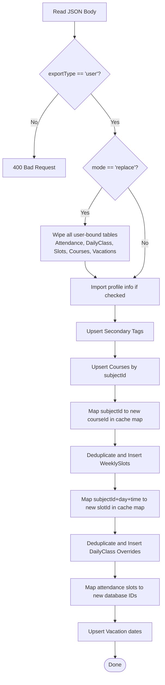

# User API: Data Importer

This endpoint processes and restores a JSON schedule backup block generated by the exporter, located at `src/app/api/user/import/route.ts`.

- **File Link**: [route.ts](file:///d:/02_CODE/04_TEST/Routine/src/app/api/user/import/route.ts)
- **Backlinks**: [[index]], [[component_setup_view]], [[api]], [[api_user_export]]

---

## 1. Endpoint Configuration

- **HTTP Method**: `POST`
- **Route URL**: `/api/user/import`
- **Authentication**: Required (`User` session check)
- **URL Query Parameters**:
  - `mode` (`String`, Optional): Mode is either `"merge"` (default, upserts parameters and leaves other entries intact) or `"replace"` (wipes all existing student tables first).

---

## 2. Re-Resolution & Insertion Algorithm

Because MySQL auto-increment primary IDs (e.g. `courseId`) differ between database instances, the import endpoint uses a step-by-step resolution algorithm using memory maps (caches) to reconstruct foreign key relationships:



- **Course Mapping Cache**: Maps `subjectId` keys to newly inserted database integers `subjectIdToNewCourseId`.
- **Slot Mapping Cache**: Maps slot descriptors `subjectId|dayOfWeek|startTime` to newly inserted database slot integers `slotRefToNewSlotId`.
- **Daily Class Resolution**: Looks up class date overrides and checks matching slot IDs from the cache maps.
- **Attendance Mapping**: Before inserting, queries matching slot IDs and daily override class IDs to build valid foreign key indices.

---

## 3. Implementation Code Breakdown

The source code in `src/app/api/user/import/route.ts` is divided into logical execution phases:

### Phase 1: Authentication and Header Validation
Verify user credentials and validate the import file header type and versions.

```typescript
import { NextRequest, NextResponse } from 'next/server';
import { getAuthenticatedUser } from '@/lib/auth';
import { prisma } from '@/lib/prisma';

export async function POST(req: NextRequest) {
  try {
    const user = await getAuthenticatedUser();
    const { searchParams } = new URL(req.url);
    const mode = searchParams.get('mode') === 'replace' ? 'replace' : 'merge';

    const body = await req.json();

    // Validate export file type
    if (body.exportType !== 'user') {
      return NextResponse.json(
        { error: 'Invalid export file: exportType must be "user". Did you mean to use the admin import?' },
        { status: 400 }
      );
    }
    if (!body.version) {
      return NextResponse.json({ error: 'Invalid export file: missing version' }, { status: 400 });
    }

    const {
      profile,
      secondaryTags = [],
      courses: exportedCourses = [],
      weeklySlots: exportedSlots = [],
      dailyClasses: exportedDailyClasses = [],
      attendance: exportedAttendance = [],
      vacations: exportedVacations = [],
      importProfile = false,
    } = body;

    const counts = {
      courses: 0,
      weeklySlots: 0,
      dailyClasses: 0,
      attendance: 0,
      vacations: 0,
      secondaryTags: 0,
    };
```

---

### Phase 2: Timeline Reset (Replace Mode)
If `mode === 'replace'`, deletes user-scoped schedule tables (with cascading FK deletions) before writing the imported data.

```typescript
    if (mode === 'replace') {
      // Delete all existing user data (cascades via FK constraints)
      await prisma.attendance.deleteMany({ where: { userId: user.id } });
      await prisma.dailyClass.deleteMany({ where: { userId: user.id } });
      await prisma.weeklySlot.deleteMany({ where: { userId: user.id } });
      await prisma.course.deleteMany({ where: { userId: user.id } });
      await prisma.vacation.deleteMany({ where: { userId: user.id } });
      await prisma.userSecondaryTag.deleteMany({ where: { userId: user.id } });
    }
```

---

### Phase 3: Profile Settings & Secondary Tags Import
Saves user metadata (name, start dates) and tags mapping.

```typescript
    // Optionally update profile fields
    if (importProfile && profile) {
      await prisma.user.update({
        where: { id: user.id },
        data: {
          name: profile.name || user.name,
          color: profile.color || user.color,
          university: profile.university || user.university,
          courseName: profile.courseName || user.courseName,
          courseStartDate: profile.courseStartDate || user.courseStartDate,
        },
      });
    }

    // Import secondary tags
    for (const tag of secondaryTags) {
      if (!tag.university || !tag.courseName) continue;
      await prisma.userSecondaryTag.upsert({
        where: {
          userId_university_courseName: {
            userId: user.id,
            university: tag.university,
            courseName: tag.courseName,
          },
        },
        create: { userId: user.id, university: tag.university, courseName: tag.courseName },
        update: {},
      });
      counts.secondaryTags++;
    }
```

---

### Phase 4: Courses Import and Key Mapping Cache
Upsert course data and record the mapping from `subjectId` to the newly assigned database course ID.

```typescript
    // Import courses — upsert by (userId, subjectId)
    // Build a local map subjectId -> new DB id for subsequent slot/class resolution
    const subjectIdToNewCourseId = new Map<string, number>();

    for (const c of exportedCourses) {
      if (!c.subjectId) continue;
      const existing = await prisma.course.findUnique({
        where: { userId_subjectId: { userId: user.id, subjectId: c.subjectId } },
      });
      let courseRecord;
      if (existing) {
        courseRecord = await prisma.course.update({
          where: { id: existing.id },
          data: {
            subjectName: c.subjectName || existing.subjectName,
            subjectCode: c.subjectCode || existing.subjectCode,
            teacherName: c.teacherName || existing.teacherName,
            teacherCode: c.teacherCode || existing.teacherCode,
            teacherContact: c.teacherContact || existing.teacherContact,
            teacherEmail: c.teacherEmail || existing.teacherEmail,
            source: c.source || existing.source,
            isArchived: c.isArchived ?? existing.isArchived,
            archivedAt: c.archivedAt ?? existing.archivedAt,
          },
        });
      } else {
        courseRecord = await prisma.course.create({
          data: {
            userId: user.id,
            subjectId: c.subjectId,
            subjectName: c.subjectName || '',
            subjectCode: c.subjectCode || '',
            teacherName: c.teacherName || '',
            teacherCode: c.teacherCode || '',
            teacherContact: c.teacherContact || '',
            teacherEmail: c.teacherEmail || '',
            source: c.source || 'personal',
            isArchived: c.isArchived ?? false,
            archivedAt: c.archivedAt ?? null,
          },
        });
        counts.courses++;
      }
      subjectIdToNewCourseId.set(c.subjectId, courseRecord.id);
    }
```

---

### Phase 5: Weekly Slots Sync & Slot Cache Mapping
Maps exported weekly slots to resolved course IDs, inserts them, and tracks references.

```typescript
    // Import weekly slots — deduplicate by (userId, courseId, dayOfWeek, startTime)
    // Build a local map (subjectId+dayOfWeek+startTime) -> new DB slot id
    const slotRefToNewSlotId = new Map<string, number>();

    for (const s of exportedSlots) {
      if (!s.subjectId || !s.dayOfWeek || !s.startTime) continue;
      const courseId = subjectIdToNewCourseId.get(s.subjectId);
      if (!courseId) continue;

      const slotKey = `${s.subjectId}|${s.dayOfWeek}|${s.startTime}`;

      // Check if slot already exists
      const existing = await prisma.weeklySlot.findFirst({
        where: {
          userId: user.id,
          courseId,
          dayOfWeek: s.dayOfWeek,
          startTime: s.startTime,
        },
      });

      let slotRecord;
      if (existing) {
        slotRecord = await prisma.weeklySlot.update({
          where: { id: existing.id },
          data: {
            endTime: s.endTime || existing.endTime,
            room: s.room ?? existing.room,
            group: s.group ?? existing.group,
            activeFrom: s.activeFrom ?? existing.activeFrom,
            activeUntil: s.activeUntil ?? existing.activeUntil,
            source: s.source || existing.source,
          },
        });
      } else {
        slotRecord = await prisma.weeklySlot.create({
          data: {
            userId: user.id,
            courseId,
            dayOfWeek: s.dayOfWeek,
            startTime: s.startTime,
            endTime: s.endTime || s.startTime,
            room: s.room || null,
            group: s.group || null,
            activeFrom: s.activeFrom || null,
            activeUntil: s.activeUntil || null,
            source: s.source || 'personal',
          },
        });
        counts.weeklySlots++;
      }
      slotRefToNewSlotId.set(slotKey, slotRecord.id);
    }

    // Helper: resolve a weeklySlotRef object -> new slot ID
    const resolveSlotRef = (ref: any): number | null => {
      if (!ref) return null;
      const key = `${ref.subjectId}|${ref.dayOfWeek}|${ref.startTime}`;
      return slotRefToNewSlotId.get(key) || null;
    };
```

---

### Phase 6: Daily Overrides & Attendance Logs Synchronization
Resolves overrides and attendance records, mapping slot IDs from the cache maps.

```typescript
    // Import daily classes — deduplicate by (userId, courseId, date, weeklySlotId)
    for (const d of exportedDailyClasses) {
      if (!d.subjectId || !d.date) continue;
      const courseId = subjectIdToNewCourseId.get(d.subjectId);
      if (!courseId) continue;
      const weeklySlotId = resolveSlotRef(d.weeklySlotRef);

      const existing = await prisma.dailyClass.findFirst({
        where: {
          userId: user.id,
          courseId,
          date: d.date,
          weeklySlotId: weeklySlotId ?? null,
        },
      });

      if (!existing) {
        await prisma.dailyClass.create({
          data: {
            userId: user.id,
            courseId,
            weeklySlotId: weeklySlotId ?? null,
            date: d.date,
            startTime: d.startTime || '00:00',
            endTime: d.endTime || '00:00',
            room: d.room || null,
            group: d.group || null,
            status: d.status || 'SCHEDULED',
            isExtra: d.isExtra ?? false,
            description: d.description || null,
          },
        });
        counts.dailyClasses++;
      }
    }

    // Import attendance records — deduplicate by unique constraint
    for (const a of exportedAttendance) {
      if (!a.subjectId || !a.date || !a.status) continue;
      const courseId = subjectIdToNewCourseId.get(a.subjectId);
      if (!courseId) continue;
      const weeklySlotId = resolveSlotRef(a.weeklySlotRef);

      // Resolve dailyClassId
      let dailyClassId: number | null = null;
      if (weeklySlotId) {
        const dc = await prisma.dailyClass.findFirst({
          where: { userId: user.id, courseId, date: a.date, weeklySlotId },
        });
        dailyClassId = dc?.id || null;
      }

      const existing = await prisma.attendance.findFirst({
        where: {
          userId: user.id,
          courseId,
          date: a.date,
          weeklySlotId: weeklySlotId ?? null,
          dailyClassId: dailyClassId ?? null,
        },
      });

      try {
        if (existing) {
          await prisma.attendance.update({
            where: { id: existing.id },
            data: { status: a.status },
          });
        } else {
          await prisma.attendance.create({
            data: {
              userId: user.id,
              courseId,
              date: a.date,
              status: a.status,
              weeklySlotId: weeklySlotId ?? null,
              dailyClassId: dailyClassId ?? null,
            },
          });
        }
        counts.attendance++;
      } catch {
        // Skip duplicate records gracefully
      }
    }
```

---

### Phase 7: Vacations Import & Final Return
Upserts vacation days and returns the processed synchronization count object.

```typescript
    // Import vacations — upsert by (userId, date)
    for (const v of exportedVacations) {
      if (!v.date || !v.type) continue;
      await prisma.vacation.upsert({
        where: { userId_date: { userId: user.id, date: v.date } },
        create: {
          userId: user.id,
          date: v.date,
          type: v.type,
          description: v.description || null,
        },
        update: {
          type: v.type,
          description: v.description || null,
        },
      });
      counts.vacations++;
    }

    return NextResponse.json({
      success: true,
      mode,
      imported: counts,
    });
  } catch (error: any) {
    if (error.message === 'Unauthorized: No authenticated user') {
      return NextResponse.json({ error: 'Unauthorized' }, { status: 401 });
    }
    console.error('Error importing user data:', error);
    return NextResponse.json({ error: error.message }, { status: 500 });
  }
}
```

