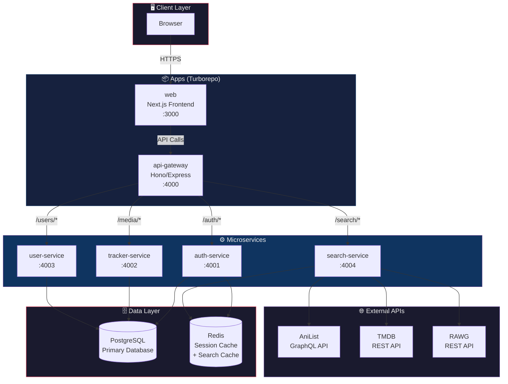
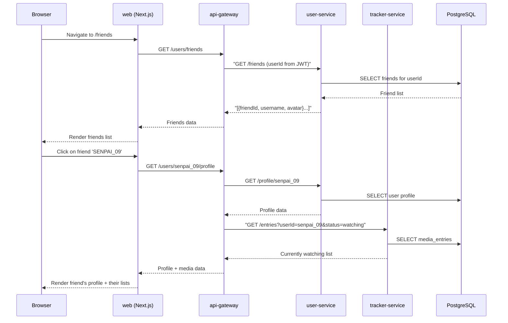
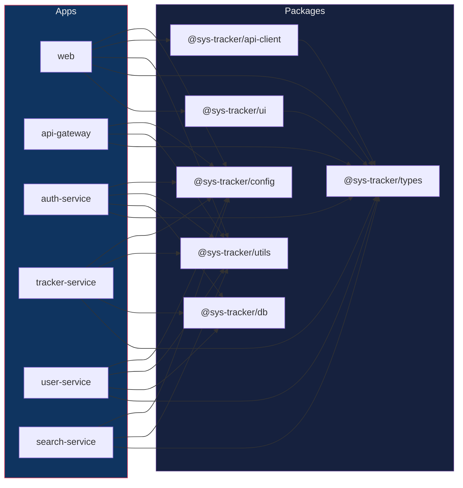
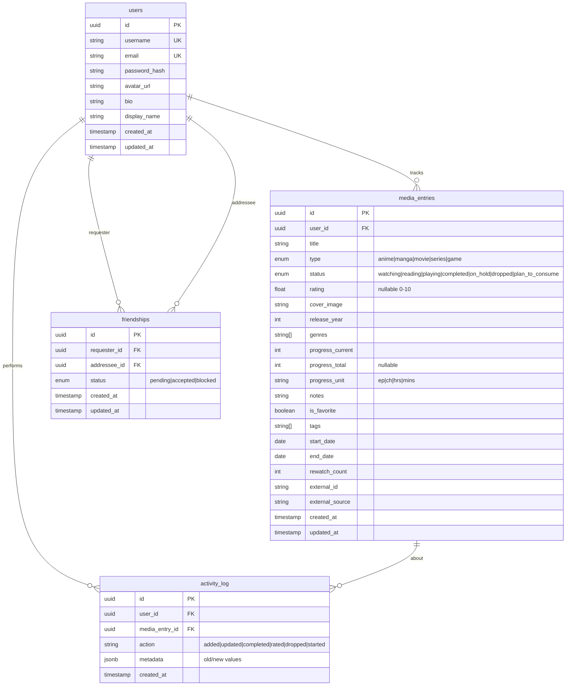

# SYS_TRACKER — Turborepo Monorepo Architecture

> Migrating the current Next.js monolith into a **Turborepo-powered monorepo** with clear service boundaries, shared packages, and a microservices-ready backend.

---

## Table of Contents

1. [Architecture Overview](#1-architecture-overview)
2. [Service Breakdown](#2-service-breakdown)
3. [Architecture Diagrams](#3-architecture-diagrams)
4. [Complete Folder Structure](#4-complete-folder-structure)
5. [Package Details](#5-package-details)
6. [Turborepo Configuration](#6-turborepo-configuration)
7. [Inter-Service Communication](#7-inter-service-communication)
8. [Database Architecture](#8-database-architecture)
9. [Development Workflow](#9-development-workflow)
10. [Deployment Strategy](#10-deployment-strategy)

---

## 1. Architecture Overview

### Why Turborepo?

The current project is a single Next.js app (`imdb-gemini`) that handles everything: UI rendering, API routes, data storage (JSON files), external API calls, and business logic — all tangled together. Turborepo lets us split this into **focused, independently deployable services** while sharing code through internal packages.

### Core Principles

| Principle | What It Means |
|-----------|---------------|
| **Service isolation** | Each service owns its domain — auth handles auth, tracker handles media, etc. |
| **Shared packages** | Common types, UI components, and utilities live in `packages/` — no copy-pasting |
| **Independent scaling** | The media tracker API can scale separately from the auth service |
| **Single dev command** | `turbo dev` spins up everything in parallel with caching |
| **Type safety across boundaries** | Shared TypeScript types ensure contracts between services |
### What We're Building (Scoped)

- ✅ Personal media tracker (anime, manga, movies, series, games)
- ✅ Friends list — view what friends are tracking
- ✅ User profiles with stats
- ✅ Authentication
- ❌ ~~AI recommendations~~ (out of scope)
- ❌ ~~Community features / forums~~ (out of scope)

---

## 2. Service Breakdown

### Apps (Deployable Services)

| App | Type | Purpose | Port |
|-----|------|---------|------|
| `web` | Next.js (Frontend) | The main dashboard UI — all pages, components, and client-side logic | `3000` |
| `api-gateway` | Express/Hono | Central API gateway — routes requests to the right microservice, handles CORS, rate limiting | `4000` |
| `auth-service` | Express/Hono | Authentication — signup, login, sessions, OAuth, JWT issuance | `4001` |
| `tracker-service` | Express/Hono | Core media tracking — CRUD for media entries, progress updates, favorites | `4002` |
| `user-service` | Express/Hono | User profiles, friends list, friend requests, profile settings | `4003` |
| `search-service` | Express/Hono | External API aggregation — AniList, TMDB, RAWG search proxying and caching | `4004` |
### Packages (Shared Internal Libraries)

| Package | Purpose |
|---------|---------|
| `@sys-tracker/ui` | Shared React component library (buttons, cards, modals, badges, skeletons) |
| `@sys-tracker/types` | Shared TypeScript types/interfaces — `MediaEntry`, `User`, `FriendRequest`, API contracts |
| `@sys-tracker/utils` | Shared utility functions — formatters, validators, constants, helpers |
| `@sys-tracker/db` | Database client, schema definitions (Prisma/Drizzle), migrations |
| `@sys-tracker/config` | Shared config — ESLint, TypeScript, Tailwind configs |
| `@sys-tracker/api-client` | Type-safe API client for frontend ↔ gateway communication |
---

## 3. Architecture Diagrams

### 3.1 High-Level System Architecture



### 3.2 Request Flow — "User Adds a Media Entry"

```mermaid
sequenceDiagram
    participant B as Browser
    participant W as web (Next.js)
    participant G as api-gateway
    participant A as auth-service
    participant T as tracker-service
    participant S as search-service
    participant DB as PostgreSQL

    B->>W: User searches 'Steins;Gate'
    W->>G: "GET /search?q=steins;gate&type=anime"
    G->>A: Validate JWT token
    A-->>G: "✅ Token valid (userId: xyz)"
    G->>S: "GET /search?q=steins;gate&type=anime"
    S->>S: Check Redis cache
    S-->>G: Return AniList + TMDB results
    G-->>W: Search results
    W-->>B: Display results

    B->>W: User clicks "Add to List"
    W->>G: POST /media/entries
    G->>A: Validate JWT token
    A-->>G: ✅ Token valid
    G->>T: "POST /entries {title, type, status...}"
    T->>DB: INSERT INTO media_entries
    DB-->>T: ✅ Created
    T-->>G: 201 Created
    G-->>W: Entry created
    W-->>B: Show success toast
```

### 3.3 Friends List Flow



### 3.4 Package Dependency Graph



### 3.5 Database Schema (Entity Relationship)



---

## 4. Complete Folder Structure

```
sys-tracker/                          # Root monorepo
│
├── turbo.json                        # Turborepo pipeline config
├── package.json                      # Root package.json (workspaces)
├── pnpm-workspace.yaml               # pnpm workspace definition
├── .gitignore
├── .env.example                      # Shared env template
├── .eslintrc.js                      # Root ESLint (extends @sys-tracker/config)
├── tsconfig.json                     # Root TypeScript config (base)
├── README.md
├── docker-compose.yml                # Local dev: Postgres + Redis
├── docker-compose.prod.yml           # Production compose
│
├── apps/
│   │
│   ├── web/                          # ═══ NEXT.JS FRONTEND ═══
│   │   ├── package.json
│   │   ├── next.config.ts
│   │   ├── tsconfig.json
│   │   ├── postcss.config.mjs
│   │   ├── .env.local                # NEXT_PUBLIC_API_URL, etc.
│   │   │
│   │   ├── public/
│   │   │   ├── favicon.ico
│   │   │   ├── og-image.png          # Open Graph preview
│   │   │   └── fonts/                # Self-hosted fonts (optional)
│   │   │
│   │   └── src/
│   │       ├── app/                   # Next.js App Router
│   │       │   ├── layout.tsx         # Root layout (providers, navbar, footer)
│   │       │   ├── page.tsx           # Landing / dashboard
│   │       │   ├── globals.css        # Global styles + design tokens
│   │       │   ├── favicon.ico
│   │       │   │
│   │       │   ├── (auth)/            # Auth route group
│   │       │   │   ├── login/
│   │       │   │   │   └── page.tsx
│   │       │   │   ├── register/
│   │       │   │   │   └── page.tsx
│   │       │   │   └── layout.tsx     # Auth-specific layout (no navbar)
│   │       │   │
│   │       │   ├── (dashboard)/       # Protected dashboard routes
│   │       │   │   ├── layout.tsx     # Dashboard layout (sidebar + navbar)
│   │       │   │   ├── page.tsx       # Main dashboard (overview)
│   │       │   │   │
│   │       │   │   ├── anime/
│   │       │   │   │   └── page.tsx   # Anime list page
│   │       │   │   ├── manga/
│   │       │   │   │   └── page.tsx
│   │       │   │   ├── movies/
│   │       │   │   │   └── page.tsx
│   │       │   │   ├── series/
│   │       │   │   │   └── page.tsx
│   │       │   │   ├── games/
│   │       │   │   │   └── page.tsx
│   │       │   │   │
│   │       │   │   ├── media/
│   │       │   │   │   └── [type]/
│   │       │   │   │       └── [id]/
│   │       │   │   │           └── page.tsx  # Individual media detail page
│   │       │   │   │
│   │       │   │   ├── friends/
│   │       │   │   │   ├── page.tsx           # Friends list
│   │       │   │   │   └── [username]/
│   │       │   │   │       └── page.tsx       # View friend's profile + lists
│   │       │   │   │
│   │       │   │   ├── profile/
│   │       │   │   │   └── page.tsx           # Own profile + stats
│   │       │   │   │
│   │       │   │   └── settings/
│   │       │   │       └── page.tsx           # Account settings
│   │       │   │
│   │       │   └── not-found.tsx
│   │       │
│   │       ├── components/
│   │       │   ├── layout/
│   │       │   │   ├── Navbar.tsx
│   │       │   │   ├── Sidebar.tsx
│   │       │   │   ├── Footer.tsx
│   │       │   │   └── CommandPalette.tsx      # Ctrl+K search
│   │       │   │
│   │       │   ├── dashboard/
│   │       │   │   ├── ActivityFeed.tsx
│   │       │   │   ├── QuickStats.tsx
│   │       │   │   ├── CurrentlyConsuming.tsx
│   │       │   │   ├── RecentlyCompleted.tsx
│   │       │   │   └── FavoritesList.tsx
│   │       │   │
│   │       │   ├── media/
│   │       │   │   ├── MediaCard.tsx
│   │       │   │   ├── MediaGrid.tsx
│   │       │   │   ├── MediaListView.tsx
│   │       │   │   ├── MediaDetailView.tsx
│   │       │   │   ├── MediaModal.tsx          # Quick edit modal
│   │       │   │   ├── CreateMediaModal.tsx
│   │       │   │   ├── MediaFilters.tsx        # Multi-criteria filter bar
│   │       │   │   └── ProgressTracker.tsx
│   │       │   │
│   │       │   ├── friends/
│   │       │   │   ├── FriendCard.tsx
│   │       │   │   ├── FriendRequestCard.tsx
│   │       │   │   ├── FriendSearch.tsx
│   │       │   │   └── FriendActivityFeed.tsx
│   │       │   │
│   │       │   ├── profile/
│   │       │   │   ├── ProfileHeader.tsx
│   │       │   │   ├── StatsOverview.tsx
│   │       │   │   └── ProfileSettings.tsx
│   │       │   │
│   │       │   └── auth/
│   │       │       ├── LoginForm.tsx
│   │       │       └── RegisterForm.tsx
│   │       │
│   │       ├── hooks/
│   │       │   ├── useAuth.ts
│   │       │   ├── useMedia.ts
│   │       │   ├── useFriends.ts
│   │       │   ├── useDebounce.ts
│   │       │   └── useCommandPalette.ts
│   │       │
│   │       ├── providers/
│   │       │   ├── AuthProvider.tsx
│   │       │   ├── QueryProvider.tsx       # TanStack Query
│   │       │   └── ThemeProvider.tsx
│   │       │
│   │       ├── lib/
│   │       │   ├── api.ts                  # API client instance
│   │       │   └── auth.ts                 # Auth helpers
│   │       │
│   │       └── styles/
│   │           └── animations.css          # Keyframes + transitions
│   │
│   ├── api-gateway/                  # ═══ API GATEWAY ═══
│   │   ├── package.json
│   │   ├── tsconfig.json
│   │   ├── Dockerfile
│   │   ├── .env.local
│   │   │
│   │   └── src/
│   │       ├── index.ts               # Server entry point
│   │       ├── routes/
│   │       │   ├── auth.routes.ts     # Proxy /auth/* → auth-service
│   │       │   ├── media.routes.ts    # Proxy /media/* → tracker-service
│   │       │   ├── users.routes.ts    # Proxy /users/* → user-service
│   │       │   └── search.routes.ts   # Proxy /search/* → search-service
│   │       │
│   │       ├── middleware/
│   │       │   ├── authenticate.ts    # JWT verification
│   │       │   ├── rateLimit.ts       # Rate limiting per route
│   │       │   ├── cors.ts            # CORS configuration
│   │       │   ├── logger.ts          # Request logging
│   │       │   └── errorHandler.ts    # Global error handler
│   │       │
│   │       └── config/
│   │           └── services.ts        # Service URLs + health check config
│   │
│   ├── auth-service/                 # ═══ AUTH SERVICE ═══
│   │   ├── package.json
│   │   ├── tsconfig.json
│   │   ├── Dockerfile
│   │   ├── .env.local
│   │   │
│   │   └── src/
│   │       ├── index.ts               # Server entry
│   │       ├── routes/
│   │       │   └── auth.routes.ts     # /register, /login, /logout, /refresh, /me
│   │       ├── controllers/
│   │       │   └── auth.controller.ts
│   │       ├── services/
│   │       │   └── auth.service.ts    # Business logic (hash, verify, JWT)
│   │       ├── middleware/
│   │       │   └── validate.ts        # Zod schema validation
│   │       └── schemas/
│   │           └── auth.schema.ts     # Zod schemas: RegisterInput, LoginInput
│   │
│   ├── tracker-service/              # ═══ TRACKER SERVICE (CORE) ═══
│   │   ├── package.json
│   │   ├── tsconfig.json
│   │   ├── Dockerfile
│   │   ├── .env.local
│   │   │
│   │   └── src/
│   │       ├── index.ts               # Server entry
│   │       ├── routes/
│   │       │   ├── entries.routes.ts   # CRUD: /entries
│   │       │   ├── progress.routes.ts  # /entries/:id/progress  (increment, set)
│   │       │   ├── favorites.routes.ts # /entries/favorites
│   │       │   └── stats.routes.ts     # /stats (aggregated per-user stats)
│   │       ├── controllers/
│   │       │   ├── entries.controller.ts
│   │       │   ├── progress.controller.ts
│   │       │   ├── favorites.controller.ts
│   │       │   └── stats.controller.ts
│   │       ├── services/
│   │       │   ├── entries.service.ts
│   │       │   ├── progress.service.ts
│   │       │   └── stats.service.ts
│   │       ├── middleware/
│   │       │   └── validate.ts
│   │       └── schemas/
│   │           ├── entry.schema.ts    # Zod: CreateEntry, UpdateEntry, FilterParams
│   │           └── progress.schema.ts
│   │
│   ├── user-service/                 # ═══ USER SERVICE ═══
│   │   ├── package.json
│   │   ├── tsconfig.json
│   │   ├── Dockerfile
│   │   ├── .env.local
│   │   │
│   │   └── src/
│   │       ├── index.ts
│   │       ├── routes/
│   │       │   ├── profile.routes.ts    # /profile, /profile/:username
│   │       │   └── friends.routes.ts    # /friends, /friends/requests, /friends/:id
│   │       ├── controllers/
│   │       │   ├── profile.controller.ts
│   │       │   └── friends.controller.ts
│   │       ├── services/
│   │       │   ├── profile.service.ts
│   │       │   └── friends.service.ts
│   │       ├── middleware/
│   │       │   └── validate.ts
│   │       └── schemas/
│   │           ├── profile.schema.ts
│   │           └── friends.schema.ts
│   │
│   └── search-service/              # ═══ SEARCH SERVICE ═══
│       ├── package.json
│       ├── tsconfig.json
│       ├── Dockerfile
│       ├── .env.local
│       │
│       └── src/
│           ├── index.ts
│           ├── routes/
│           │   └── search.routes.ts     # /search?q=...&type=...
│           ├── controllers/
│           │   └── search.controller.ts
│           ├── services/
│           │   ├── search.service.ts     # Aggregation logic
│           │   ├── anilist.service.ts    # AniList GraphQL client
│           │   ├── tmdb.service.ts       # TMDB REST client
│           │   └── rawg.service.ts       # RAWG REST client
│           ├── cache/
│           │   └── searchCache.ts        # Redis-backed search result caching
│           └── schemas/
│               └── search.schema.ts
│
├── packages/
│   │
│   ├── types/                        # ═══ @sys-tracker/types ═══
│   │   ├── package.json
│   │   ├── tsconfig.json
│   │   └── src/
│   │       ├── index.ts               # Re-exports everything
│   │       ├── media.ts               # MediaEntry, MediaType, MediaStatus
│   │       ├── user.ts                # User, UserProfile
│   │       ├── friends.ts             # Friendship, FriendRequest
│   │       ├── activity.ts            # ActivityLogEntry
│   │       ├── auth.ts                # AuthTokens, Session
│   │       └── api.ts                 # ApiResponse<T>, PaginatedResponse<T>, ErrorResponse
│   │
│   ├── ui/                           # ═══ @sys-tracker/ui ═══
│   │   ├── package.json
│   │   ├── tsconfig.json
│   │   └── src/
│   │       ├── index.ts               # Re-exports all components
│   │       ├── Button.tsx
│   │       ├── Badge.tsx
│   │       ├── Card.tsx
│   │       ├── Modal.tsx
│   │       ├── Input.tsx
│   │       ├── Select.tsx
│   │       ├── Skeleton.tsx
│   │       ├── Toast.tsx
│   │       ├── Avatar.tsx
│   │       ├── Tooltip.tsx
│   │       ├── ProgressBar.tsx
│   │       ├── StarRating.tsx
│   │       └── styles/
│   │           └── tokens.css         # Design tokens (colors, spacing, fonts)
│   │
│   ├── utils/                        # ═══ @sys-tracker/utils ═══
│   │   ├── package.json
│   │   ├── tsconfig.json
│   │   └── src/
│   │       ├── index.ts
│   │       ├── formatters.ts          # formatRating(), formatProgress(), formatDate()
│   │       ├── validators.ts          # isValidRating(), isValidProgress()
│   │       ├── constants.ts           # DEFAULT_COVER_IMAGES, STATUS_OPTIONS, MEDIA_TYPES
│   │       ├── mediaHelpers.ts        # getTypeMeta(), getStatusColor(), getProgressPercent()
│   │       └── errors.ts             # AppError, NotFoundError, ValidationError
│   │
│   ├── db/                           # ═══ @sys-tracker/db ═══
│   │   ├── package.json
│   │   ├── tsconfig.json
│   │   ├── drizzle.config.ts          # Drizzle ORM config (or prisma/schema.prisma)
│   │   └── src/
│   │       ├── index.ts               # DB client export
│   │       ├── client.ts              # Database connection
│   │       ├── schema/
│   │       │   ├── users.ts
│   │       │   ├── media-entries.ts
│   │       │   ├── friendships.ts
│   │       │   └── activity-log.ts
│   │       └── migrations/
│   │           └── ...                # Auto-generated migration files
│   │
│   ├── api-client/                   # ═══ @sys-tracker/api-client ═══
│   │   ├── package.json
│   │   ├── tsconfig.json
│   │   └── src/
│   │       ├── index.ts
│   │       ├── client.ts              # Axios/fetch wrapper with interceptors
│   │       ├── auth.api.ts            # login(), register(), logout(), getMe()
│   │       ├── media.api.ts           # getEntries(), createEntry(), updateEntry()...
│   │       ├── users.api.ts           # getProfile(), updateProfile()
│   │       ├── friends.api.ts         # getFriends(), sendRequest(), acceptRequest()
│   │       └── search.api.ts          # search()
│   │
│   └── config/                       # ═══ @sys-tracker/config ═══
│       ├── package.json
│       ├── eslint/
│       │   ├── base.js                # Shared ESLint rules
│       │   ├── next.js                # Next.js-specific rules
│       │   └── node.js                # Node service rules
│       ├── typescript/
│       │   ├── base.json              # Base tsconfig
│       │   ├── nextjs.json            # Next.js tsconfig extends base
│       │   └── node.json              # Node service tsconfig extends base
│       └── tailwind/
│           └── preset.js              # Shared Tailwind preset (colors, fonts)
│
├── tooling/                          # ═══ TOOLING & SCRIPTS ═══
│   ├── scripts/
│   │   ├── setup.sh                   # One-command project setup
│   │   ├── seed.ts                    # Database seeding script
│   │   └── migrate.ts                 # Run migrations across all services
│   └── docker/
│       ├── Dockerfile.service         # Generic service Dockerfile
│       └── nginx.conf                 # Reverse proxy config (production)
│
└── .github/
    └── workflows/
        ├── ci.yml                     # Lint + type-check + test on PR
        └── deploy.yml                 # Deploy on merge to main
```

---

## 5. Package Details

### `@sys-tracker/types` — The Contract Layer

This is the most critical package. Every service and the frontend import types from here, ensuring type safety across service boundaries.

```typescript
// packages/types/src/media.ts

export type MediaType = "anime" | "manga" | "game" | "movie" | "series";

export type MediaStatus =
  | "watching"
  | "reading"
  | "playing"
  | "completed"
  | "on_hold"
  | "dropped"
  | "plan_to_consume";
export interface MediaEntry {
  id: string;
  userId: string;

  // Core
  title: string;
  type: MediaType;
  coverImage: string;
  releaseYear: number | null;
  genres: string[];

  // Tracking
  status: MediaStatus;
  rating: number | null;          // 0-10 scale
  progressCurrent: number;
  progressTotal: number | null;
  progressUnit: "ep" | "ch" | "hrs" | "mins";

  // Personal
  notes: string;
  isFavorite: boolean;
  tags: string[];
  startDate: string | null;       // ISO date string
  endDate: string | null;
  rewatchCount: number;

  // External
  externalId?: string;
  externalSource?: "anilist" | "tmdb" | "rawg";

  // Timestamps
  createdAt: string;
  updatedAt: string;
}
```

```typescript
// packages/types/src/user.ts

export interface User {
  id: string;
  username: string;
  email: string;
  displayName: string;
  avatarUrl: string | null;
  bio: string;
  createdAt: string;
  updatedAt: string;
}

export interface UserProfile extends User {
  stats: {
    totalEntries: number;
    totalCompleted: number;
    totalWatching: number;
    meanScore: number;
    entriesByType: Record<MediaType, number>;
  };
}
```

```typescript
// packages/types/src/friends.ts

export type FriendshipStatus = "pending" | "accepted" | "blocked";

export interface Friendship {
  id: string;
  requesterId: string;
  addresseeId: string;
  status: FriendshipStatus;
  createdAt: string;
}

export interface FriendWithProfile {
  friendship: Friendship;
  user: Pick<User, "id" | "username" | "displayName" | "avatarUrl">;
  currentlyWatching?: MediaEntry[];  // Optional: what they're currently tracking
}
```

```typescript
// packages/types/src/api.ts

export interface ApiResponse<T> {
  success: boolean;
  data: T;
  message?: string;
}

export interface PaginatedResponse<T> {
  success: boolean;
  data: T[];
  pagination: {
    page: number;
    pageSize: number;
    totalItems: number;
    totalPages: number;
  };
}

export interface ErrorResponse {
  success: false;
  error: {
    code: string;
    message: string;
    details?: Record<string, string[]>;
  };
}
```

### `@sys-tracker/db` — Schema Definition

Using Drizzle ORM with PostgreSQL:

```typescript
// packages/db/src/schema/users.ts

import { pgTable, uuid, varchar, text, timestamp } from "drizzle-orm/pg-core";

export const users = pgTable("users", {
  id: uuid("id").primaryKey().defaultRandom(),
  username: varchar("username", { length: 30 }).unique().notNull(),
  email: varchar("email", { length: 255 }).unique().notNull(),
  passwordHash: varchar("password_hash", { length: 255 }).notNull(),
  displayName: varchar("display_name", { length: 50 }).notNull(),
  avatarUrl: text("avatar_url"),
  bio: text("bio").default(""),
  createdAt: timestamp("created_at").defaultNow().notNull(),
  updatedAt: timestamp("updated_at").defaultNow().notNull(),
});
```

```typescript
// packages/db/src/schema/media-entries.ts

import { pgTable, uuid, varchar, text, integer, real,
         boolean, timestamp, date, pgEnum } from "drizzle-orm/pg-core";
import { users } from "./users";

export const mediaTypeEnum = pgEnum("media_type",
  ["anime", "manga", "game", "movie", "series"]);

export const mediaStatusEnum = pgEnum("media_status",
  ["watching", "reading", "playing", "completed", "on_hold", "dropped", "plan_to_consume"]);

export const progressUnitEnum = pgEnum("progress_unit",
  ["ep", "ch", "hrs", "mins"]);

export const mediaEntries = pgTable("media_entries", {
  id: uuid("id").primaryKey().defaultRandom(),
  userId: uuid("user_id").references(() => users.id).notNull(),
  title: varchar("title", { length: 300 }).notNull(),
  type: mediaTypeEnum("type").notNull(),
  status: mediaStatusEnum("status").notNull().default("plan_to_consume"),
  coverImage: text("cover_image").default(""),
  releaseYear: integer("release_year"),
  genres: text("genres").array().default([]),
  rating: real("rating"),
  progressCurrent: integer("progress_current").default(0).notNull(),
  progressTotal: integer("progress_total"),
  progressUnit: progressUnitEnum("progress_unit").default("ep").notNull(),
  notes: text("notes").default(""),
  isFavorite: boolean("is_favorite").default(false).notNull(),
  tags: text("tags").array().default([]),
  startDate: date("start_date"),
  endDate: date("end_date"),
  rewatchCount: integer("rewatch_count").default(0).notNull(),
  externalId: varchar("external_id", { length: 100 }),
  externalSource: varchar("external_source", { length: 20 }),
  createdAt: timestamp("created_at").defaultNow().notNull(),
  updatedAt: timestamp("updated_at").defaultNow().notNull(),
});
```

---

## 6. Turborepo Configuration

### Root `package.json`

```jsonc
{
  "name": "sys-tracker",
  "private": true,
  "scripts": {
    "dev": "turbo dev",
    "build": "turbo build",
    "lint": "turbo lint",
    "type-check": "turbo type-check",
    "db:generate": "turbo db:generate",
    "db:migrate": "turbo db:migrate",
    "db:seed": "turbo db:seed",
    "clean": "turbo clean"
  },
  "devDependencies": {
    "turbo": "^2.5.0",
    "typescript": "^5.8.0"
  },
  "packageManager": "pnpm@9.15.0"
}
```

### `turbo.json`

```jsonc
{
  "$schema": "https://turbo.build/schema.json",
  "globalDependencies": ["**/.env.*local"],
  "tasks": {
    "build": {
      "dependsOn": ["^build"],
      "outputs": [".next/**", "!.next/cache/**", "dist/**"],
      "env": ["NODE_ENV", "DATABASE_URL"]
    },
    "dev": {
      "cache": false,
      "persistent": true,
      "dependsOn": ["^build"]
    },
    "lint": {
      "dependsOn": ["^build"]
    },
    "type-check": {
      "dependsOn": ["^build"]
    },
    "clean": {
      "cache": false
    },
    "db:generate": {
      "cache": false
    },
    "db:migrate": {
      "cache": false
    },
    "db:seed": {
      "cache": false
    }
  }
}
```

### `pnpm-workspace.yaml`

```yaml
packages:
  - "apps/*"
  - "packages/*"
```

---

## 7. Inter-Service Communication

### API Gateway Routing Table

| Gateway Route | Target Service | Auth Required |
|--------------|----------------|---------------|
| `POST /auth/register` | auth-service → `/register` | ❌ |
| `POST /auth/login` | auth-service → `/login` | ❌ |
| `POST /auth/logout` | auth-service → `/logout` | ✅ |
| `GET  /auth/me` | auth-service → `/me` | ✅ |
| `GET  /media/entries` | tracker-service → `/entries` | ✅ |
| `POST /media/entries` | tracker-service → `/entries` | ✅ |
| `PUT  /media/entries/:id` | tracker-service → `/entries/:id` | ✅ |
| `DELETE /media/entries/:id` | tracker-service → `/entries/:id` | ✅ |
| `PATCH /media/entries/:id/progress` | tracker-service → `/entries/:id/progress` | ✅ |
| `GET  /media/stats` | tracker-service → `/stats` | ✅ |
| `GET  /media/favorites` | tracker-service → `/entries/favorites` | ✅ |
| `GET  /users/profile` | user-service → `/profile` | ✅ |
| `GET  /users/profile/:username` | user-service → `/profile/:username` | ✅ (public read) |
| `PUT  /users/profile` | user-service → `/profile` | ✅ |
| `GET  /users/friends` | user-service → `/friends` | ✅ |
| `POST /users/friends/request` | user-service → `/friends/request` | ✅ |
| `PUT  /users/friends/:id/accept` | user-service → `/friends/:id/accept` | ✅ |
| `DELETE /users/friends/:id` | user-service → `/friends/:id` | ✅ |
| `GET  /search` | search-service → `/search` | ✅ |
### Authentication Flow

```
Client → Gateway → auth-service
                       │
                       ├── Register: hash password → store in DB → return JWT
                       ├── Login: verify password → issue JWT + refresh token
                       └── Middleware: verify JWT on every protected request

JWT Payload:
{
  "sub": "user-uuid",
  "username": "SENPAI_09",
  "iat": 1717100000,
  "exp": 1717186400     // 24h expiry
}
```

### Cross-Service Data Access

When viewing a friend's profile, the gateway orchestrates:

```
GET /users/profile/:username  →  user-service (profile data)
GET /media/entries?userId=X   →  tracker-service (their media lists)
                                    ↓
                              Aggregated response → Client
```

> **Note:** Services NEVER call each other directly. The API gateway handles all orchestration. This keeps services truly independent.

---

## 8. Database Architecture

### Single Database, Logical Separation

All services share ONE PostgreSQL database but access only their own tables:

| Service | Tables Owned | Access Level |
|---------|-------------|--------------|
| `auth-service` | `users` (password_hash column only) | Read/Write `users` |
| `tracker-service` | `media_entries`, `activity_log` | Read/Write own tables, Read `users.id` |
| `user-service` | `friendships` | Read/Write `friendships`, Read `users` profile columns |
This avoids the complexity of multiple databases while maintaining logical separation. A future migration to separate DBs per service is straightforward since each service already queries only its own tables.

### Indexes

```sql
-- Performance-critical indexes
CREATE INDEX idx_media_entries_user_id ON media_entries(user_id);
CREATE INDEX idx_media_entries_type ON media_entries(type);
CREATE INDEX idx_media_entries_status ON media_entries(status);
CREATE INDEX idx_media_entries_user_type ON media_entries(user_id, type);
CREATE INDEX idx_media_entries_user_status ON media_entries(user_id, status);
CREATE INDEX idx_media_entries_favorite ON media_entries(user_id, is_favorite) WHERE is_favorite = true;

CREATE INDEX idx_friendships_requester ON friendships(requester_id);
CREATE INDEX idx_friendships_addressee ON friendships(addressee_id);
CREATE INDEX idx_friendships_status ON friendships(status);

CREATE INDEX idx_activity_log_user ON activity_log(user_id);
CREATE INDEX idx_activity_log_created ON activity_log(created_at DESC);
```

---

## 9. Development Workflow

### First-Time Setup

```bash
# 1. Clone the repo
git clone https://github.com/your-username/sys-tracker.git
cd sys-tracker

# 2. Install dependencies (pnpm workspaces will link everything)
pnpm install

# 3. Start local infrastructure
docker compose up -d    # Starts Postgres + Redis

# 4. Set up environment variables
cp .env.example .env
# Edit .env with your API keys (TMDB, AniList, etc.)

# 5. Run database migrations
pnpm db:migrate

# 6. Seed with sample data (optional)
pnpm db:seed

# 7. Start ALL services in parallel
pnpm dev
```

### Daily Development

```bash
# Start everything (Turborepo runs all `dev` scripts in parallel)
pnpm dev

# This starts:
#   web            → http://localhost:3000
#   api-gateway    → http://localhost:4000
#   auth-service   → http://localhost:4001
#   tracker-service→ http://localhost:4002
#   user-service   → http://localhost:4003
#   search-service → http://localhost:4004
```

### Working on a Specific Service

```bash
# Run only the tracker service and its dependencies
pnpm dev --filter=tracker-service...

# Build only the web app
pnpm build --filter=web

# Lint only packages
pnpm lint --filter="./packages/*"

# Add a dependency to a specific app
pnpm add zod --filter=auth-service

# Add a shared package as a dependency
pnpm add @sys-tracker/types --filter=tracker-service --workspace
```

### Turborepo Caching

Turborepo caches build outputs. If nothing changed in `@sys-tracker/types`, it won't rebuild. This makes subsequent builds **significantly faster**.

```bash
# See what Turborepo would run (dry run)
pnpm build --dry

# Force a clean build (no cache)
pnpm build --force
```

---

## 10. Deployment Strategy

### Option A: Docker Compose (Self-Hosted / VPS)

```yaml
# docker-compose.prod.yml
services:
  postgres:
    image: postgres:16-alpine
    environment:
      POSTGRES_DB: sys_tracker
      POSTGRES_USER: tracker
      POSTGRES_PASSWORD: ${DB_PASSWORD}
    volumes:
      - pgdata:/var/lib/postgresql/data

  redis:
    image: redis:7-alpine

  api-gateway:
    build:
      context: .
      dockerfile: apps/api-gateway/Dockerfile
    ports:
      - "4000:4000"
    depends_on: [postgres, redis]

  auth-service:
    build:
      context: .
      dockerfile: apps/auth-service/Dockerfile
    depends_on: [postgres, redis]

  tracker-service:
    build:
      context: .
      dockerfile: apps/tracker-service/Dockerfile
    depends_on: [postgres]

  user-service:
    build:
      context: .
      dockerfile: apps/user-service/Dockerfile
    depends_on: [postgres]

  search-service:
    build:
      context: .
      dockerfile: apps/search-service/Dockerfile
    depends_on: [redis]

  web:
    build:
      context: .
      dockerfile: apps/web/Dockerfile
    ports:
      - "3000:3000"
    depends_on: [api-gateway]

volumes:
  pgdata:
```

### Option B: Cloud Platform (Recommended for Simplicity)

| Service | Deploy To |
|---------|-----------|
| `web` | Vercel (free tier, optimized for Next.js) |
| `api-gateway` | Railway / Render / Fly.io |
| `auth-service` | Railway / Render / Fly.io |
| `tracker-service` | Railway / Render / Fly.io |
| `user-service` | Railway / Render / Fly.io |
| `search-service` | Railway / Render / Fly.io |
| PostgreSQL | Supabase / Neon / Railway |
| Redis | Upstash (serverless Redis, free tier) |
---

## Migration Checklist: Current → Turborepo

Here's how to migrate from the current monolith step by step:

### Phase 1: Scaffold

- [ ] Initialize Turborepo with `npx create-turbo@latest`
- [ ] Set up `pnpm-workspace.yaml` and `turbo.json`
- [ ] Create all app and package directories
- [ ] Move current Next.js code into `apps/web/`

### Phase 2: Extract Packages

- [ ] Extract types from inline interfaces → `packages/types/`
- [ ] Extract shared components (Button, Badge, Toast, etc.) → `packages/ui/`
- [ ] Extract utility functions (formatters, constants) → `packages/utils/`
- [ ] Set up shared configs → `packages/config/`

### Phase 3: Database

- [ ] Set up PostgreSQL via Docker Compose
- [ ] Define schemas in `packages/db/` using Drizzle
- [ ] Write migration scripts
- [ ] Create a seed script from current JSON data

### Phase 4: Services

- [ ] Build `auth-service` with JWT-based auth
- [ ] Build `tracker-service` — migrate JSON read/write logic to Postgres queries
- [ ] Build `user-service` — profile + friends
- [ ] Build `search-service` — extract `apiHelpers.ts` logic
- [ ] Build `api-gateway` — route everything together

### Phase 5: Frontend Update

- [ ] Replace direct `fs.readFile` calls with API client calls
- [ ] Add `AuthProvider` and protect routes
- [ ] Build friends list UI
- [ ] Update all components to use `@sys-tracker/ui` and `@sys-tracker/types`

---

> [!TIP]
> **Start with Phase 1 + 2.** Just scaffolding the monorepo and extracting packages will immediately make your codebase cleaner, even before you build any microservices. You can keep the current JSON-based API routes in `apps/web/` initially and migrate them to separate services one by one.
